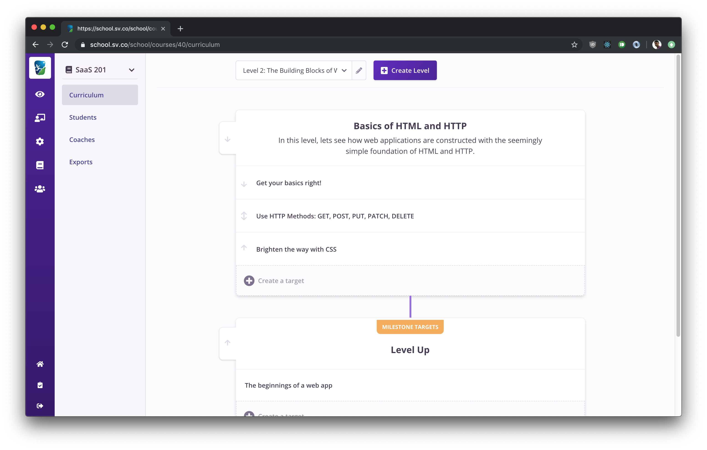
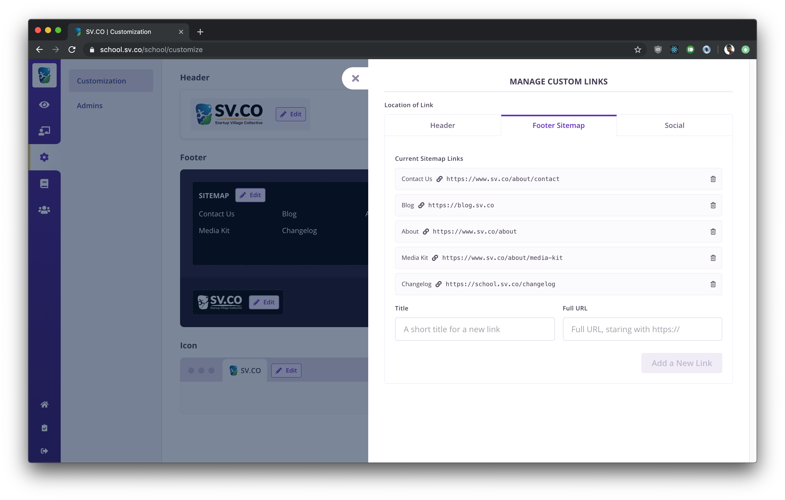
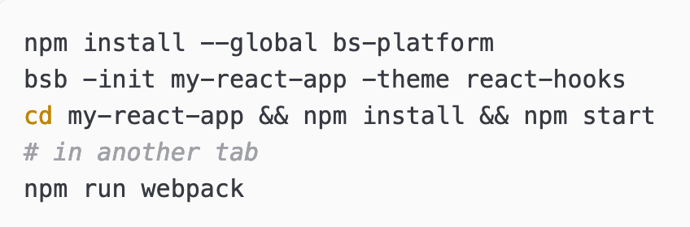

---
title: Learning to learn ReasonML
subtitle: ""
fontsize: 17pt
...

```
    
    LEARNING TO LEARN REASONML

    Jasim A Basheer 
    protoship.io

    @jasim_ab


```

&nbsp;

::: notes

Hello, my name is Jasim, and I'm here today to talk about ReasonML.

:::

------------------


::: notes

A little about me, I've been programming professionally for over 10 years now. 
This is one of the earliest software that I built.

:::

------------------


::: notes

Here's another. These were fun to make and they were simpler times. But today that is an outdated stack.

I've since worked on modern web applications, front-end, back-end, and also different languages including Javascript.

Most recently I've been jamming with a friend building tools for designers & front-end developers. 

:::

------------------

### Protoship Teleport


::: notes

One is called Teleport -- it is a Chrome extension that can capture a website and create a Sketch design out of it.

The other tool is called Protoship Codegen.

:::

------------------

### Protoship Codegen


::: notes

It converts designs - made in tools like Adobe XD and Sketch - into responsive HTML and CSS, which programmers like you and me can use. So it'll do static positioning, flexboxes, grids, and CSS etc.

:::

------------------


::: notes

On the screen is a sample Sketch design, we're running it through Codegen,
and this is the Codegen UI, and the design was rendered here as HTML & CSS.

All this stuff: the Sketch plugin, the web UI, and the code generator -- everything, is written in Reason.

But that happened only about half-way through the product. Before that it was all Javascript.

We didn't know Reason or Typed FP when began working on this product over two years ago. We had to learn it so we could build this tool.

For that let me tell you a bit about how Codegen works under the hood.

:::


------------------

### Source data: Raw Vector Node


::: notes

See here, is the source data. 

It is a node for a vector design element, that Codegen extracted from Sketch. They're absolutely positioned, as you can see from x, y, and width and height.

Our goal is to convert this into responsive HTML and CSS.

:::

------------------


::: notes

That's a multi-step process. Here's a rough pipeline of how Codegen does it:

:::

------------------


::: notes

In each step here, we decorate the nodes with more info, sometimes change their shapes, sometimes merge it with others, and things like that.

:::

------------------

``` {.javascript}
{
  x: 0,
  y: 64,
  name: "The classics are books",
  width: 600
  height: 63
}
```

::: notes

For illustration, here is a possible initial shape of the node.

:::


------------------

``` {.javascript}
{
  x: 0,
  y: 64,
  name: "The classics are books",
  width: 600
  height: 63
}
```

``` {.javascript}
{
  nodeType: "text",
  marginLeft: 0,
  marginTop: 64,
  width: 600,
  height: 63
}
```

::: notes

Now this could be its next shape.

:::


------------------

``` {.javascript}
{
  nodeType: "text",
  marginLeft: 0,
  marginTop: 64,
  width: 600,
  height: 63
}
```

::: notes

which could again take another shape,

:::


------------------

``` {.javascript}
{
  nodeType: "text",
  marginLeft: 0,
  marginTop: 64,
  width: 600,
  height: 63
}
```

``` {.javascript}
{
  nodeType: "text",
  marginLeft: {type: "px", value: 0},
  marginTop: {type: "px", value: 64},
  width: {type: "px", value: 600},
  height: {type: "px", value: 63}
}
```

::: notes

And this could be its next shape, and so on. There were hundreds of these transformations, some small, some big, and it was too much for us to mentally track. 

We kept making mistakes and any progress on the product sort of halted.

We knew we needed a better way to deal with our data, and had an inkling that types could be the answer.

:::


------------------

&nbsp;

#### Reason is released

```
AUTHOR
Jordan Walke (and Cheng Lou and others)

WROTE
React, Reason, and ReasonReact
```

::: notes

That was the time around when Jordan Walke, the original author of React, released the first version of Reason. He also shipped ReasonReact, which is the Reason adaptor for the React UI library. 

Reason was a typed language, and it compiled to Javascript. So we could rewrite all our transformation code in Reason and have it work on both Node and the browser.

Also thanks to ReasonReact, we could even build UIs and mix and match both React and Javascript code.

So that's what we did!

:::


------------------


::: notes

But learning and adopting this language was a long struggle. We spent countless hours with the Real World OCaml book. 

We looked upon it with both delight at the insights on programming it gave us, and also with a fair amount of dread and frustration. It wasn't an easy book to get through.

But the struggle was worth it. It was worth so much that when I look back on the last 10 years of my programming career, I wonder what I was doing for the first 8 years, those years before I learned Reason and Typed functional programming.

And that is why I'm so excited to be here today, and talk to you all about ReasonML. 

:::

------------------

### The Talk


* Reason: interesting bits
* How does it feel to program
* How to get started

::: notes

Okay, now we can begin!

In this talk I will try to describe the interesting bits of Reason - the things that are different from Javascript.

I'll also try to give you a feel for how it would be to program with this language, and finally leave you with a roadmap on how to learn it.

:::


------------------

## Reason is OCaml

* First released in 1990

* C like speeds

* ISWIM syntax (OCaml, Haskell) not ALGOL (C, Java, Javascript etc.)

::: notes

Reason is a new syntax on top of the OCaml programming language. 

OCaml has a long history - it was first released in 1990 - about 30 years ago. It is a compiled language and produces very fast binaries.

Its syntax however is quite different from most languages that we're used to.

:::

------------------

``` {.ocaml .smallFont}
let print_html_table segments =
  printf "<table>\n";
  List.iter (fun line ->
    printf "<tr>";
    List.iter (fun c -> printf "<td>%s</td>" (escape c)) line;
    printf "</tr>\n";
  ) segments;
  printf "</table>\n";
;;
```

::: notes

Here is an OCaml program that prints an HTML table from a 2-dimensional list. See that function arguments are separated by spaces, and anonymous functions are created with the `fun` keyboard.

:::

------------------

``` {.ocaml .smallFont}
let print_html_table segments =
  printf "<table>\n";
  List.iter (fun line ->
    printf "<tr>";
    List.iter (fun c -> printf "<td>%s</td>" (escape c)) line;
    printf "</tr>\n";
  ) segments;
  printf "</table>\n";
;;
```

``` {.ocaml .smallFont}
let print_html_table = segments => {
  printf("<table>\n");
  List.iter(
    line => {
      printf("<tr>");
      List.iter(c => printf("<td>%s</td>", escape(c)), line);
      printf("</tr>\n");
    },
    segments,
  );
  printf("</table>\n");
};
```

::: notes

Here's the same OCaml code, but in the Reason syntax. This is closer to ES6 as we know it - there are braces to denote blocks. The fat arrow operator lets us create functions and semicolons for separating lines.

Underneath, however Reason and OCaml are the same language and have the same semantics. In this presentation I'll use refer to Reason and OCaml interchangeably, depending on what fits the context better.

:::

------------------

## What can we build with Reason/OCaml?

::: notes

So is it actually useful? This language. What can we build with it? Let me take you through some examples.

:::

------------------

#### High-frequency trading software

&nbsp;


::: notes

When you start reading about OCaml, you'll often come across Jane Street. They are one of the largest production users of the language and they do billions of dollars worth of trading, all with software written in OCaml.

:::

------------------

#### World's second largest crawler

&nbsp;


::: notes

If you have done any SEO work, you might be familiar with Ahrefs. They crawl about 5 million pages every minute, and they have the second largest index just after Google. They use native OCaml for all the back-end infra and for the front-end web they use Reason.

:::

------------------

#### Compilers

&nbsp;

* First version of the Rust compiler
* Flow (typechecker for Javascript)
* Hack (Facebook's PHP compiler)

&nbsp;

::: notes

OCaml is also particularly nice to write compilers on - in fact anything that deals with a lot of tree manipulation is a great fit. Rust borrows many ideas from OCaml, and their first compiler was written in the language. Facebook is also a large user of OCaml internally.

5mins

:::

------------------

## Front-end web applications!

&nbsp;

Compile Reason into clean performant Javascript

::: notes

Those were the traditional applications of OCaml. 

OCaml can also be used to build front-end web applications, which is what this talk is about. 

Let us take a look at that next.

:::


------------------

### OCaml has three compilers:

&nbsp;

##### 1) Native `ocamlc`: produces _executable binary_


::: notes


The native OCaml compiler is a thing of beauty - both the compiler and the generated binaries are extremely fast and lightweight, but they produce native binaries. So if you had something you wanted to build with say GoLang, you can use OCaml or Reason instead.


:::

------------------

### OCaml has three compilers:

&nbsp;

##### 1) Native `ocamlc`: produces _executable binary_ {.muted}
##### 2) `js_of_ocaml`: produces _Javascript_, can use any OCaml library

::: notes

Then there is js_of_ocaml -- it is a fork of the OCaml library, and it produces Javascript instead of native binaries. But it is sort of isolated from the Javascript ecosystem - it can make use of OCaml libraries, but nothing from npm.

:::


------------------

### OCaml has three compilers:

&nbsp;

##### 1) Native `ocamlc`: produces _executable binary_ {.muted}
##### 2) `js_of_ocaml`: produces _Javascript_, can use any OCaml library {.muted}
##### 3) BuckleScript `bsc`: produces _Javascript_, and can use any npm package

::: notes

Then we have BuckleScript. This compiler produces clean, performant Javascript, and it interops nicely with npm and the rest of the Javascript ecosystem.

:::

------------------

## BuckleScript

* Clean performant Javascript
* Build NodeJS applications
* Build Browser applications


::: notes

BuckleScript was written at Bloomberg, who is also a large user of OCaml.

Reason uses BuckleScript for all its stuff. It generates readable and fast Javascript, and we can use it to run on either Node or on the browser.

:::

------------------

``` {.ocaml}
if (MomentRe.Moment.isSameWithGranularity(
      MomentRe.momentNow(),
      MomentRe.moment("2020-04-01"),
      `day,
    )) {
  Js.log("It is the 1st of April!");
} else {
  Js.log("A dreary day");
};
```

::: notes

Here's BuckleScript in action.

The code written here, though it looks like Javascript, is actually Reason. It checks whether the current day is April 1st 2020, and then shows a message.For this it uses the momentjs Javascript library from npm. 

Okay, now let's run this code through BuckleScript.

:::

------------------

``` {.ocaml}
if (MomentRe.Moment.isSameWithGranularity(
      MomentRe.momentNow(),
      MomentRe.moment("2020-04-01"),
      `day,
    )) {
  Js.log("It is the 1st of April!");
} else {
  Js.log("A dreary day");
};
```

``` {.javascript}
// Generated by BUCKLESCRIPT VERSION 5.0.6, PLEASE EDIT WITH CARE
'use strict';

var Moment = require("moment");
var MomentRe = require("bs-moment/src/MomentRe.js");

if (Moment().isSame(MomentRe.moment(undefined, "2020-04-01"), "day")) {
  console.log("It is the 1st of April!");
} else {
  console.log("A dreary day");
}
```

::: notes

At the bottom is the Javascript produced by BuckleScript. It is straightforward JS, and it uses the CommonJS syntax to require the momentjs npm module.

That's one of the best thing about Reason: since we're using BuckleScript, we can use any and all npm library in our code. Also, since Reason code becomes Javascript, we can export that as npm packages as well.

:::


------------------

#### A real-world application, built with BuckleScript and Reason

::: notes

Okay, before moving into the language proper, I want to show you a real-world web application built with BuckleScript and Reason.

:::

------------------


::: notes

This project is called PupilFirst. It is a learning management solution - create courses, teach students, and manage their progress.

The entire front-end is written in Reason and compiled with BuckleScript. It extensively uses GraphQL for data fetching, and is built with Rails on the back-end.

:::


------------------



::: notes

It has a complex data model and advanced UI patterns.

:::


------------------



::: notes

It is built here in Bangalore.

:::


------------------


::: notes

And it is fully open-source. One of the authors, Hari Gopal, is also a JsFoo speaker. He had spoken in last year's conference and that was also about Reason.

This is a good reference repository if you want to see a real-world reason web application that is used in production.

Okay.

:::

------------------

## Paradigm

&nbsp;

### Reason/OCaml is a Typed Functional language

::: notes


:::

------------------

## Paradigm

&nbsp;

### Reason/OCaml is a Typed Functional language

&nbsp;
&nbsp;

_so is Haskell, Elm, F#, and PureScript_

::: notes


:::

------------------

## Typed FP

#### has two principles:

### 1. Write pure functions
### 2. Get their types right

::: notes

The tiny surface area of the language also constrains how we can program in Reason.

The way to do that is to simply write our programs as a series of pure functions. That's it. 

How is that an improvement over Javascript you might ask? We can write JS also in a functional manner - with pure functions everywhere, and just an outer shell for all the I/O. That's essentially functional programming, and that's pretty nice.

But Reason is not only "functional", it is also "typed", and the types guarantee something:

:::

------------------

## Perfection

The perfect computer program -- 

::: notes

"perfection".

Reason functions are more "perfect" than functions written in Javascript. I'm using the word "perfection" here, based on a talk given by Prof. Xavier Leroy, who is a programming languages researcher and also the author OCaml

:::

------------------

> (a perfect program is) The one that does exactly what it should do, no more, no less, every time, with perfect reliability, and forever. The kind of perfection that you can get from mathematical definitions, which software is to a large extent, or from philosophical concepts.

<sub><sup>"In search of software perfection", by Dr. Xavier Leroy, author of OCaml</sub></sup>

::: notes

"A perfect program does exactly what it should do, no more, no less, every time, with perfect reliability, and forever. The kind of perfection that you can get from mathematical definitions, which software is to a large extent, or from philosophical concepts."

What can that mean in the context of our day-to-day programming work? Let's take a look.

::: 

------------------

``` {.javascript}
let showNext = lastUser => {
  console.log("You will be user " + (lastUser.id + 1))
}
```

``` {.javascript}
showNext({id: 16})
```

```
You will be user 17
```

::: notes

Consider this function `showNext` - it tells you what your user id could be, based on the last user in the system. 

We pass it an object with id 16, and it prints 17. The code is as simple as it can get. 

But does it work perfectly reliably all the time, every time? Will it ever crash in production?

:::

------------------

``` {.javascript}
let showNext = u => {
  console.log("You will be user " + (u.id + 1))
}
```

``` {.javascript}
showNext({id: null)
```

::: notes

What if `id` is null?

:::

------------------


``` {.javascript}
let showNext = u => {
  console.log("You will be user " + (u.id + 1))
}
```

``` {.javascript}
showNext({id: null)
```

```
You will be user 1
```

::: notes

Thankfully that works. Our function is resilient to nulls.

:::

------------------

``` {.javascript}
let showNext = u => {
  console.log("You will be user " + (u.id + 1))
}
```

``` {.javascript}
showNext({id: "193"})
```

::: notes

What if id was a string?

:::

------------------

``` {.javascript}
let showNext = u => {
  console.log("You will be user " + (u.id + 1))
}
```

``` {.javascript}
showNext({id: "193"})
```

```
You will be user 1931
```

::: notes

It doesn't crash, but the result isn't what we wanted. 

:::

------------------

``` {.javascript}
let showNext = u => {
  console.log("You will be user " + (u.id + 1))
}
```

``` {.javascript}
showNext({})
```

::: notes

Now what happens when the object is empty?

:::

------------------

``` {.javascript}
let showNext = u => {
  console.log("You will be user " + (u.id + 1))
}
```

``` {.javascript}
showNext({})
```

```
You will be user NaN
```

::: notes

This is also a wrong result.

:::

------------------

``` {.javascript}
let showNext = u => {
  console.log("You will be user " + (u.id + 1))
}
```

``` {.javascript}
let users = []
let lastUser = users[users.length - 1]

showNext(lastUser)
```

::: notes

Here we have a list of users, and we'll find the last of them and apply to `showNext`

But unfortunately, the list is empty. What happens now?

:::

------------------

``` {.javascript}
let showNext = u => {
  console.log("You will be user " + (u.id + 1))
}
```

``` {.javascript}
let users = []
let lastUser = users[users.length - 1]

showNext(lastUser)
```

```
Uncaught TypeError: Cannot read property 'id' of undefined
```

::: notes

The function actually crashes. 

This is a common source of error when programming in JS - we fetch a value from an array or an object -- and sometimes it doesn't exist -- which means it returns a null or an undefined. We then pass that down to other functions.. and things crash in production. Sometimes they crash far away from the place where the undefined originated, and so we have to work backwards quite a bit to debug it. 

:::

------------------

``` {.javascript}
showNext()
showNext({id: "a"})
showNext({id: {}})
showNext(undefined)
showNext(null)
showNext(0)
showNext("a")
showNext([])
showNext([1])
showNext(a => a + 1)
```

::: notes

Okay, to make a long story short, none of the invokations here would work correctly. 

:::

------------------

``` {.javascript}
showNext({id: 112})
```

```
You will be user 113
```

::: notes

The only way the function can succeed is when it receives an object which has a field `id`, which has an integer value.

So why does Javascript allow this function to be called with any other kind of argument? What if we could write functions that will always work because they always receive the right kind of data. It will change the way we write software.

This is done in Reason with type definitions - it is sort of a metadata that mentions what the shape and structure of different values in the program are.

Let's see how that works.

:::

------------------

``` {.javascript}
type user = {

}
```

::: notes

Here is a Reason type definition; we're saying that there is a type called user

:::

------------------

``` {.javascript}
type user = {
  id
}
```

::: notes

which has a field `id`

:::

------------------

``` {.javascript}
type user = {
  id: int
};
```

::: notes

whose values are always integers.

Now let's write `showNext` in Reason.

:::

------------------

``` {.javascript}
type user = {
  id: int
};

let showNext = u => {
  Js.log("You will be user " ++ string_of_int(u.id + 1));
};
```

::: notes

You can see that there is an explicit cast from integer to string, but otherwise the Reason version looks similar to the ES6 version. Let us run it.

:::


------------------

``` {.javascript}
type user = {
  id: int
};

let showNext = u => {
  Js.log("You will be user " ++ string_of_int(u.id + 1));
};

showNext({id: 15});
```

```
You will be user 16
```

::: notes

It works. Can we send this function invalid data, and break it, like we did with the JS version?

:::

------------------


``` {.javascript}
type user = { id: int };
let showNext = u => {
  Js.log("You will be user " ++ string_of_int(u.id + 1));
};
showNext({id: "abc"});
```


::: notes

Yes it breaks! But this is a compile-time breakage. This means no Javascript code was generated for this Reason program we wrote.

That's because the compiler found a type error in the code.

:::


------------------

``` {.javascript}
type user = { id: int };
let showNext = u => {
  Js.log("You will be user " ++ string_of_int(u.id + 1));
};
showNext({id: "abc"});
```


::: notes

It inferred that the function `showNext` expects a value of type `user`, and `user` should have an integer id column inside it. But instead of `user` we sent a random string. That'll definitely break the function in runtime, so Reason wouldn't allow it to move past compilation.

But how did Reason figure out that `showNext` expects a value of type `user`? We haven't mentioned that explicitly anywhere. What's happening is "type inference" -- if you imagined that you'll have to litter your codebase with type annotations, then type inference will make you happy.

Based on the context, Reason figures out the types of values and arguments to functions. It works well even for large programs.

Now let's see how Reason fares with other invalid values.

:::

------------------

``` {.javascript}
showNext({id: []});
```


::: notes

We're passing in a list instead of an integer. Type error.

:::

------------------

``` {.javascript}
showNext(a => a + 1);
```


::: notes

Here's a function instead of the entire `user` object. Type error again. 

:::


------------------

``` {.javascript}
type user = { id: int };

let showNext = u => {
  Js.log("You will be user " ++ string_of_int(u.id + 1));
};

showNext({id: 44});
showNext({id: 299});
showNext({id: -44});
```

```
You will be user 45
You will be user 300
You will be user -4
```

::: notes

We can keep going, but the only way to get the program to compile is to pass `showNext` the correct data. That's the number one promise of Typed FP.

:::


------------------


### A Compilation error is a Syntax error
#### Elevate runtime errors into compiler errors.
#### Super! 😎

::: notes


:::

------------------

&nbsp;

&nbsp;

### If it compiles, it works

::: notes

A lot of my programming anxiety went away after I started programming with Reason. Because I know that if my program compiles, it works.

Its true! 

But, what about logical errors?

:::


------------------

```
  if item == "tea"
    pourCoffee()
  else
    pourTea()
```

::: notes

Here someone asked for a tea, and we poured them a coffee. It will compile, but it is obviously wrong. This is a logical error, not a type error, and so the compiler cannot catch it.

:::

------------------

&nbsp;

### Programming is difficult...

due to clerical errors.

Logical mistakes are rare!

::: notes

But when I started writing typed FP after about a decade of dynamically typed languages, I realized that we programmers are a pretty decent bunch. It is very rare for us to be making logical errors in our code.

Our programs are all broken, make no mistake, but they are broken not because we wrote something when we meant the other. They're borken because of clerical mistakes. Passing the wrong data to the wrong function. 

But the Reason compiler is very good at catching those mistakes, which is why, "if it compiles, it works".

:::


------------------


::: notes

There is also something else to note: the program has no control over what data comes from the external world - like content that we read from the database

:::


------------------


::: notes

or JSON API responses

:::


------------------


::: notes

or even user inputs from the browser.

:::


------------------


::: notes

We handle it in Reason by parsing all external data at the application boundary. In this picture I've labelled it as the "application membrane". 

(It is not a formal concept or anything by the way, I just made it up. But it has a nice ring to it no?)

:::


------------------


::: notes

If the data that hits the application doesn't slot into their corresponding types, then we can handle it then and there. Maybe it is an old API format and we're on a new version. So there is nothing to be done except reject it and return an HTTP error code.

Or the incoming data is incomplete -- but we can handle it gracefully by putting placeholder values. 

Or it is simply wrong data and not salvageable. The point is we cannot allow malformed data into our system. Either we handle it, or we stop the request there.

:::


------------------


::: notes

But if there are no issues, then this data gets parsed into our application types, and it hits the core.

:::


------------------


::: notes

We can write this core without a single defensive check; no worries about null errors; not bothered whether the objects will have the right shape. We know, thanks to types, that everything will be just perfect.

:::

------------------

## A comparison

Concepts that carry over from Javascript to Reason

::: notes

Now let's briefly compare Javascript and Reason -- what concepts can you take from the Javascript world to the Reason world

:::

------------------

## Javascript vs Reason

* **Javascript**: `this`, variable hoisting, prototypes, ES6 classes, objects, mutations, _functions, modules_

* **Reason**: _functions, modules, types_

::: notes
Except for types, Reason is, in a sense, a subset of Javascript.

Javascript is a large language -- which could be obvious if you've participated in any Javascript job interview. 

You can ask and be asked so many questions. There is the concept of `this`, there are prototypes and prototype inheritance chains, and there are also classes, objects, and mutation. It also has functions and higher-order functions.

Compared to a Javascript job interview, a Reason interview could be rather uneventful; because it is a much smaller language than JS. All it has are functions, modules, and types. We don't, for example, concern ourselves with what `this` could be during runtime. 

:::

------------------

### Learning Reason

::: notes

Alright, the final segment.

If you had to give Reason a shot, how would you go about it? 

One common approach, which usually works well, is to learn by poking. This is instinctive to the way we learn as programmers.

:::


------------------

### Reason, bottom-up learning 

* **Programming in the small**
  * variables, data structures, iteration, functions


::: notes

First, to learn any language, we have to be able to write small programs in it. You should be able to solve a fizzbuzz, read from a file, compute an average, make an API request -- all these things. The concepts are standard: data structures, creating functions and calling them etc.

The official Reason documentation is a great starting point.

:::


------------------

### Learning Reason

* Programming in the small
* **Tooling**

::: notes

Next, you need to get comfortable with the tooling. 

You should be able to create a project, compile, and start tinkering on demand. That is a simple step but very crucial. 

Knowing the tooling is the difference between wishing you had the time to play with something vs actually having fun with it.

:::


------------------

### Learning Reason

* **Tooling**
  * VSCode + Reason plugin
  * Official setup instructions



::: notes

In Reason's case, there isn't much to the tooling. The most supported setup is VSCode + the VSCode Reason plugin.

The official setup guide works perfectly well to setup a new project. Install an npm package, start webpack and you're off to the races.

:::

------------------

### Learning Reason

* Programming in the large
  * modules


::: notes

The third thing to know is to how to Program in the Large. Have you ever been in a place where you know a thing - a language or a library - but you're not yet confident to use it in production?

The missing thing usually is not knowing how to fit things into a larger canvas. In the case of Reason, the only construct you need to know is  the `module`. It is very similar to regular JS modules -- you can put a bunch of functions together, expose only a few public ones, and that's it.

:::


------------------

### Programming by poking

> You grab this piece of library and you poke at it. You write programs that poke it and see what it does. And you say, ‘Can I tweak it to do the thing I want?'

-- (paraphrased) Gerald Jay Sussman

::: notes

What is Sussman calls programming by poking is sort of the bread and butter of programmers now. If we want to learn a new library for example, we'll copy some sample code, tweak it, and over time we get it working, and we also learn its fundamentals through that experience.

This is what let's call the top-down approach to learning. We also need a bottom-up approach when learning a language like Reason.

:::


------------------

#### Top-down learning + Bottom-up learning

::: notes

What this means is that we should simply go through the catalog of language features and learn them -- without looking for any immediate application. 

It is beacause in Typed FP, there are concepts that could be totally alien to those of us who've not done it before. And so when we try making something practical and get stuck, we won't even know what to look for.

So you have to combine both the top-down approach - learning by poking and also bottom-up where you learn the foundations ground up. 

:::

------------------

#### Top-down learning + Bottom-up learning


::: notes

The best way to do that is to try making something with Reason and pursue the Real World OCaml book in parallel. It uses the OCaml syntax, but that should only be a minor hiccup. 

It is a great book because it teaches not just OCaml the language. You'll also get some very practical, very profound insights on programming itself from the book.

:::

------------------

&nbsp;
&nbsp;

### Come for the language,
### Stay for the paradigm.

::: notes


:::

------------------


#### Learning to learn ReasonML

Jasim A Basheer

twitter: 
 @jasim_ab

email:
 jasim@protoship.io

web:
 protoship.io

::: notes


:::


::: notes

* Show how behaviour is added
* Be explicit on data flow
* No runtime errors. 1 or 2 errors in Elm Feldman.

:::

# Fin.

------------------


``` {.javascript}
showNext({id: null});
```


::: notes

But what about null? What if we pass null to `showNext`?

Again the code does not compile. This is because Reason doesn't even have the concept of nulls. the concept of nulls. So instead of allowing to run the code and crash at runtime, it simply prevents the code from even being even executed. 

But we use nulls in Javascript to represent the "absence" of something. Reason does have an elegant way to do that. I will show how that works soon.

:::
