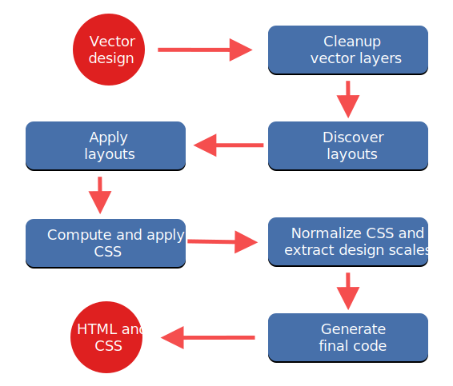
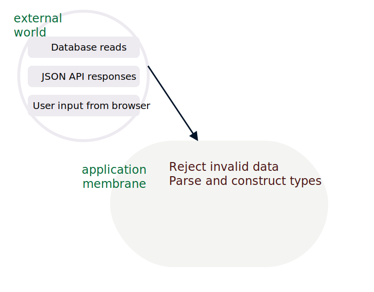
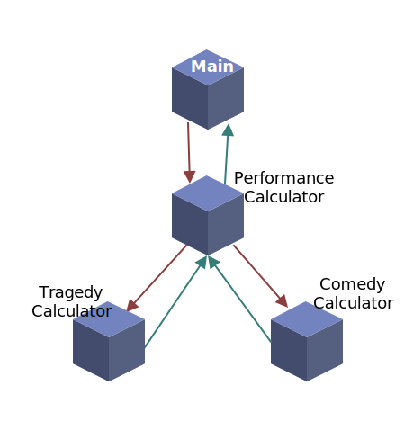

---
title: Learning to learn ReasonML
subtitle: ""
fontsize: 17pt
...

```
    
    LEARNING TO LEARN REASONML

    Jasim A Basheer 
    protoship.io

    @jasim_ab


```

&nbsp;

::: notes

Hello, my name is Jasim, and I'm here today to talk about ReasonML.

:::

------------------


::: notes

A little about me, I've been programming professionally for over 10 years now. 
This is one of the earliest software that I built.

:::

------------------


::: notes

Here's another. They use very old outdated technologies.

But thankfully I've since worked on modern web applications, front-end, back-end, and also different languages including Javascript.

Most recently I've been jamming with a friend building tools for designers & front-end developers. 

:::

------------------

### Protoship Teleport


::: notes

One is called Teleport -- it is a Chrome extension that can capture a website and create a Sketch design out of it.

The other tool is called Protoship Codegen.

:::

------------------


::: notes

It converts designs - made in tools like Adobe XD and Sketch - into responsive HTML and CSS, which programmers like you and me can use. So it'll do static positioning, flexboxes, grids, and CSS that is cleaner than anything that I'd be able to write manually. 

On the screen is a sample Sketch design,

:::


------------------


::: notes

and this is how it gets converted to code. This is the Codegen UI, and the rendering is all clean HTML and CSS. 

All this stuff: the Sketch plugin, the Adobe XD plugin, the converter, the web UI, and the code generator -- everything, is written in Reason.

But that happened only about half-way through the product. Before that it was all Javascript.

We didn't know Reason or Typed FP when began working on this product over two years ago. We were rather forced to learn it. 

:::


------------------

### Raw Vector Node


::: notes

See here, is the raw vector node that Codegen extracts from Sketch. They're absolutely positioned, and it is a far way away from being responsive HTML and CSS.

:::

------------------


::: notes

The challenge is to convert that raw node into this code. That's a multi-step process. Here's a rough pipeline of how Codegen does it:

:::

------------------



::: notes

In each step here, we decorate the nodes with more info, sometimes change their shapes, sometimes merge it with others, and generally wrangle with them quite a bit.

But we couldn't mentally keep track of all that as they went through these transformations. We kept making mistakes and our thinking was muddled and progress was very slow.

We knew we needed a better way to deal with our data. It could not be an object-oriented approach because of reasons I'll explain later, but we knew it had to be some form of types.

:::


------------------

&nbsp;

#### Reason is released

```
AUTHOR
Jordan Walke (and Cheng Lou and others)

WROTE
React, Reason, and ReasonReact
```

::: notes

That was the time around when Jordan Walke, the original author of React, released the first version of Reason. He also shipped ReasonReact, which is the Reason adaptor for the React UI library. 

Reason was a typed language, and thanks to ReasonReact we could also build UIs with it and mix and match React and Javascript code.

:::


------------------


::: notes

Learning and adopting this language was a long struggle. We spent countless hours with the Real World OCaml book - it is an excellent book on the language as well the craft of programming itself. We looked upon it with both delight at the insights on programming it gave us, and also with a fair amount of dread and frustration because of its unfamiliarity.

But the struggle was worth it. See when people 

When I look back on the last 10 years of my programming career, I wonder what I was doing for the first 8, before I learned Reason and Typed functional programming.

And that's why I'm here today to talk about it. 

:::

------------------

### The Talk


* Reason: interesting bits
* How does it feel to program
* How to get started

::: notes

In this talk I will try to describe the interesting bits of Reason; try to give you a feel for what it is to program with it; and finally leave with a few pointers on how to get started.

:::


------------------

## Reason is OCaml

* First released in 1990

* C like speeds

* ISWIM syntax (OCaml, Haskell) not ALGOL (C, Java, Javascript etc.)

::: notes

Reason is a new syntax on top of the OCaml programming language. 

OCaml has a long history - it was first released in 1990 - about 30 years ago. It is a compiled language and produces very fast binaries.

Its syntax however is quite different from most languages that we're used to.

:::

------------------

``` {.ocaml .smallFont}
let print_html_table segments =
  printf "<table>\n";
  List.iter (fun line ->
    printf "<tr>";
    List.iter (fun c -> printf "<td>%s</td>" (escape c)) line;
    printf "</tr>\n";
  ) segments;
  printf "</table>\n";
;;
```

::: notes

Here is an OCaml program that prints an HTML table from a 2-dimensional list. See that function arguments are separated by spaces, and anonymous functions are created with the `fun` keyboard.

:::

------------------

``` {.ocaml .smallFont}
let print_html_table segments =
  printf "<table>\n";
  List.iter (fun line ->
    printf "<tr>";
    List.iter (fun c -> printf "<td>%s</td>" (escape c)) line;
    printf "</tr>\n";
  ) segments;
  printf "</table>\n";
;;
```

``` {.ocaml .smallFont}
let print_html_table = segments => {
  printf("<table>\n");
  List.iter(
    line => {
      printf("<tr>");
      List.iter(c => printf("<td>%s</td>", escape(c)), line);
      printf("</tr>\n");
    },
    segments,
  );
  printf("</table>\n");
};
```

::: notes

Here's the same OCaml code, but in the Reason syntax. This is closer to ES6 as we know it - there are braces to denote blocks. The fat arrow operator lets us create functions and semicolons for separating lines.

Underneath, however Reason and OCaml are the same language and have the same semantics. In this presentation I'll use refer to Reason and OCaml interchangeably, depending on what fits the context better.

:::

------------------

## What can we build with Reason/OCaml?

::: notes

So is it actually useful? This language. What can we build with it? Let me take you through some examples.

:::

------------------

#### High-frequency trading software

&nbsp;


::: notes

When you start reading about OCaml, you'll often come across Jane Street. They are one of the largest production users of the language and they do billions of dollars worth of trading, all with software written in OCaml.

:::

------------------

#### World's second largest crawler

&nbsp;


::: notes

If you have done any SEO work, you might be familiar with Ahrefs. They crawl about 5 million pages every minute, and they have the second largest index just after Google. They use native OCaml for all the back-end infra and for the front-end web they use Reason.

:::

------------------

#### Compilers

&nbsp;

* First version of the Rust compiler
* Flow (typechecker for Javascript)
* Hack (Facebook's PHP compiler)

&nbsp;

::: notes

OCaml is also particularly nice to write compilers on - in fact anything that deals with a lot of tree manipulation is a great fit. Rust borrows many ideas from OCaml, and their first compiler was written in the language. Facebook is also a large user of OCaml internally.

5mins

:::

------------------

## Front-end web applications!

&nbsp;

Compile Reason into clean performant Javascript

::: notes

Those were the traditional applications of OCaml. 

OCaml can also be used to build front-end web applications, which is what this talk is about.

:::


------------------

* OCaml compiler produces _executable binary_

* BuckleScript compiler produces _Javascript_

#### BuckleScript


::: notes

To build front-end applications, we use BuckleScript, another compiler for OCaml which emits performant Javascript and also lets us use any npm package with Reason almost seamlessly.

BuckleScript was built at Bloomberg, and Bloomberg is also a heavy OCaml user.

:::

------------------

``` {.ocaml}
if (MomentRe.Moment.isSameWithGranularity(
      MomentRe.momentNow(),
      MomentRe.moment("2020-04-01"),
      `day,
    )) {
  Js.log("It is the 1st of April!");
} else {
  Js.log("A dreary day");
};
```

::: notes

Let's now see BuckleScript in action.

This Reason code here - it checks whether the current day is April 1st 2020,
and then shows a message.

It uses the momentjs Javascript library from npm. Now let's see how the BuckleScript output looks.

:::

------------------

``` {.ocaml}
if (MomentRe.Moment.isSameWithGranularity(
      MomentRe.momentNow(),
      MomentRe.moment("2020-04-01"),
      `day,
    )) {
  Js.log("It is the 1st of April!");
} else {
  Js.log("A dreary day");
};
```

``` {.javascript}
// Generated by BUCKLESCRIPT VERSION 5.0.6, PLEASE EDIT WITH CARE
'use strict';

var Moment = require("moment");
var MomentRe = require("bs-moment/src/MomentRe.js");

if (Moment().isSame(MomentRe.moment(undefined, "2020-04-01"), "day")) {
  console.log("It is the 1st of April!");
} else {
  console.log("A dreary day");
}
```

::: notes

As you can see BuckleScript required the correct npm module and compiled everything to straightforward Javascript. 

:::


------------------

#### A real-world application, built with BuckleScript and Reason

::: notes


:::

------------------


::: notes

Here's a project built with BuckleScript and Reason and ReasonReact. It is called PupilFirst. 

:::


------------------


::: notes

It is a learning management system built here in Bangalore.

:::


------------------


::: notes

It has complex data model and advanced UI interactions.

:::


------------------


::: notes

Oh and it is fully open-source. If you want to see a real-world Reason web application, there is no better place to look. One of the authors, Hari Gopal, had also spoken at last year's JsFoo on Reason itself.

:::


------------------

# A comparison

Concepts that carry over from Javascript to Reason

::: notes

Now let's briefly compare Javascript and Reason -- what concepts can you take from the Javascript world to the Reason world

:::

------------------


## Javascript vs Reason

* **Javascript**: `this`, variable hoisting, prototypes, ES6 classes, objects, mutations, _functions, modules_

* **Reason**: _functions, modules, types_

::: notes
Except for types, Reason is, in a sense, a subset of Javascript.

Javascript is a large language -- which could be obvious if you've participated in any Javascript job interview. 

You can ask and be asked so many questions. There is the concept of `this`, there are prototypes and prototype inheritance chains, and there are also classes, objects, and mutation. It also has functions and higher-order functions.

Compared to a Javascript job interview, a Reason interview could be rather uneventful; because it is a much smaller language than JS. All it has are functions, modules, and types. We don't, for example, concern ourselves with what `this` could be during runtime. 

:::

------------------

Two principles:

1) Write pure functions
2) Get their types right

::: notes

The tiny surface area of the language also constrains how we can program in Reason.

The way to do that is to simply write our programs as a series of pure functions. That's it. 

How is that an improvement over Javascript you might ask? We can write JS also in a functional manner - with pure functions everywhere, and just an outer shell for all the I/O. That's essentially functional programming, and that's pretty nice.

But Reason is not only "functional", it is also "typed", and the types guarantee something:

:::

------------------

## Perfection

The perfect computer program -- 

::: notes

"perfection".

Reason functions are more "perfect" than functions written in Javascript. I'm using the word "perfection" here, based on a talk given by Prof. Xavier Leroy, who is a programming languages researcher and also the author OCaml

:::

------------------

> (a perfect program is) The one that does exactly what it should do, no more, no less, every time, with perfect reliability, and forever. The kind of perfection that you can get from mathematical definitions, which software is to a large extent, or from philosophical concepts.

<sub><sup>"In search of software perfection", by Dr. Xavier Leroy, author of OCaml</sub></sup>

::: notes

"A perfect program does exactly what it should do, no more, no less, every time, with perfect reliability, and forever. The kind of perfection that you can get from mathematical definitions, which software is to a large extent, or from philosophical concepts."

What can that mean in the context of our day-to-day programming work? Let's take a look.

::: 

------------------

``` {.javascript}
let showNext = lastUser => {
  console.log("You will be user " + (lastUser.id + 1))
}
```

``` {.javascript}
showNext({id: 16})
```

```
You will be user 17
```

::: notes

Consider this function `showNext` - it tells you what your user id could be, based on the last user in the system. 

We pass it an object with id 16, and it prints 17. The code is as simple as it can get. 

But does it work perfectly reliably all the time, every time? Will it ever crash in production?

:::

------------------

``` {.javascript}
let showNext = u => {
  console.log("You will be user " + (u.id + 1))
}
```

``` {.javascript}
showNext({id: null)
```

::: notes

What if `id` is null?

:::

------------------


``` {.javascript}
let showNext = u => {
  console.log("You will be user " + (u.id + 1))
}
```

``` {.javascript}
showNext({id: null)
```

```
You will be user 1
```

::: notes

Thankfully that works. Our function is resilient to nulls.

:::

------------------

``` {.javascript}
let showNext = u => {
  console.log("You will be user " + (u.id + 1))
}
```

``` {.javascript}
showNext({id: "193"})
```

::: notes

What if id was a string?

:::

------------------

``` {.javascript}
let showNext = u => {
  console.log("You will be user " + (u.id + 1))
}
```

``` {.javascript}
showNext({id: "193"})
```

```
You will be user 1931
```

::: notes

It doesn't crash, but the result isn't what we wanted. 

:::

------------------

``` {.javascript}
let showNext = u => {
  console.log("You will be user " + (u.id + 1))
}
```

``` {.javascript}
showNext({})
```

::: notes

Now what happens when the object is empty?

:::

------------------

``` {.javascript}
let showNext = u => {
  console.log("You will be user " + (u.id + 1))
}
```

``` {.javascript}
showNext({})
```

```
You will be user NaN
```

::: notes

This is also a wrong result.

:::

------------------

``` {.javascript}
let showNext = u => {
  console.log("You will be user " + (u.id + 1))
}
```

``` {.javascript}
let users = []
let lastUser = users[users.length - 1]

showNext(lastUser)
```

::: notes

Here we have a list of users, and we'll find the last of them and apply to `showNext`

But unfortunately, the list is empty. What happens now?

:::

------------------

``` {.javascript}
let showNext = u => {
  console.log("You will be user " + (u.id + 1))
}
```

``` {.javascript}
let users = []
let lastUser = users[users.length - 1]

showNext(lastUser)
```

```
Uncaught TypeError: Cannot read property 'id' of undefined
```

::: notes

The function actually crashes. 

This is a common source of error when programming in JS - we fetch a value from an array or an object -- and sometimes it doesn't exist -- which means it returns a null or an undefined. We then pass that down to other functions.. and things crash in production. Sometimes they crash far away from the place where the undefined originated, and so we have to work backwards quite a bit to debug it. 

:::

------------------

``` {.javascript}
showNext()
showNext({id: "a"})
showNext({id: {}})
showNext(undefined)
showNext(null)
showNext(0)
showNext("a")
showNext([])
showNext([1])
showNext(a => a + 1)
```

::: notes

Okay, to make a long story short, none of the invokations here would work correctly. 

:::

------------------

``` {.javascript}
showNext({id: 112})
```

```
You will be user 113
```

::: notes

The only way the function can succeed is when it receives an object which has a field `id`, which has an integer value.

So why does Javascript allow this function to be called with any other kind of argument? What if we could write functions that will always work because they always receive the right kind of data. It will change the way we write software.

This is done in Reason with type definitions - it is sort of a metadata that mentions what the shape and structure of different values in the program are.

Let's see how that works.

:::


------------------

``` {.javascript}
type user = {

}
```

::: notes

Here is a Reason type definition; we're saying that there is a type called user

:::

------------------

``` {.javascript}
type user = {
  id
}
```

::: notes

which has a field `id`

:::

------------------

``` {.javascript}
type user = {
  id: int
};
```

::: notes

whose values are always integers.

Now let's write `showNext` in Reason.

:::

------------------

``` {.javascript}
type user = {
  id: int
};

let showNext = u => {
  Js.log("You will be user " ++ string_of_int(u.id + 1));
};
```

::: notes

You can see that there is an explicit cast from integer to string, but otherwise the Reason version looks similar to the ES6 version. Let us run it.

:::


------------------

``` {.javascript}
type user = {
  id: int
};

let showNext = u => {
  Js.log("You will be user " ++ string_of_int(u.id + 1));
};

showNext({id: 15});
```

```
You will be user 16
```

::: notes

It works. Can we send this function invalid data, and break it, like we did with the JS version?

:::

------------------


``` {.javascript}
type user = { id: int };
let showNext = u => {
  Js.log("You will be user " ++ string_of_int(u.id + 1));
};
showNext({id: "abc"});
```


::: notes

Yes it breaks! But this is a compile-time breakage. This means no Javascript code was generated for this Reason program we wrote.

That's because the compiler found a type error in the code.

:::


------------------

``` {.javascript}
type user = { id: int };
let showNext = u => {
  Js.log("You will be user " ++ string_of_int(u.id + 1));
};
showNext({id: "abc"});
```


::: notes

It inferred that the function `showNext` expects a value of type `user`, and `user` should have an integer id column inside it. But instead of `user` we sent a random string. That'll definitely break the function in runtime, so Reason wouldn't allow it to move past compilation.

But how did Reason figure out that `showNext` expects a value of type `user`? We haven't mentioned that explicitly anywhere. What's happening is "type inference" -- if you imagined that you'll have to litter your codebase with type annotations, then type inference will make you happy.

Based on the context, Reason figures out the types of values and arguments to functions. It works well even for large programs.

Now let's see how Reason fares with other invalid values.

:::

------------------

``` {.javascript}
showNext({id: []});
```


::: notes

We're passing in a list instead of an integer. Type error.

:::

------------------

``` {.javascript}
showNext(a => a + 1);
```


::: notes

Here's a function instead of the entire `user` object. Type error again. 

:::


------------------

``` {.javascript}
type user = { id: int };

let showNext = u => {
  Js.log("You will be user " ++ string_of_int(u.id + 1));
};

showNext({id: 44});
showNext({id: 299});
showNext({id: -44});
```

```
You will be user 45
You will be user 300
You will be user -4
```

::: notes

We can keep going, but the only way to get the program to compile is to pass `showNext` the correct data. That's the number one promise of Typed FP.

:::


------------------

&nbsp;

&nbsp;

### If it compiles, it works

::: notes

A lot of my programming anxiety went away after I started programming with Reason. Because I know that if my program compiles, it works.

Its true! 

But, what about logical errors?

:::


------------------

```
  if item == "tea"
    pourCoffee()
  else
    pourTea()
```

::: notes

Here someone asked for a tea, and we poured them a coffee. It will compile, but it is obviously wrong. This is a logical error, not a type error, and so the compiler cannot catch it.

:::

------------------

&nbsp;

### Programming is difficult...

due to clerical errors.

Logical mistakes are rare!

::: notes

But when I started writing typed FP after about a decade of dynamically typed languages, I realized that we programmers are a pretty decent bunch. It is very rare for us to be making logical errors in our code.

Our programs are all broken, make no mistake, but they are broken not because we wrote something when we meant the other. They're borken because of clerical mistakes. Passing the wrong data to the wrong function. 

But the Reason compiler is very good at catching those mistakes, which is why, "if it compiles, it works".

:::


------------------


::: notes

There is also something else to note: the program has no control over what data comes from the external world - like content that we read from the database

:::


------------------


::: notes

or JSON API responses

:::


------------------


::: notes

or even user inputs from the browser.

:::


------------------


::: notes

We handle it in Reason by parsing all external data at the application boundary. In this picture I've labelled it as the "application membrane". 

(It is not a formal concept or anything by the way, I just made it up. But it has a nice ring to it no?)

:::


------------------


::: notes

If the data that hits the application doesn't slot into their corresponding types, then we can handle it then and there. Maybe it is an old API format and we're on a new version. So there is nothing to be done except reject it and return an HTTP error code.

Or the incoming data is incomplete -- but we can handle it gracefully by putting placeholder values. 

Or it is simply wrong data and not salvageable. The point is we cannot allow malformed data into our system. Either we handle it, or we stop the request there.

:::


------------------



::: notes

But if there are no issues, then this data gets parsed into our application types, and it hits the core.

:::


------------------


::: notes

We can write this core without a single defensive check; no worries about null errors; not bothered whether the objects will have the right shape. We know, thanks to types, that everything will be just perfect.

:::

------------------

# A larger code example

------------------

#### Refactoring (2nd edition) 
#### by Martin Fowler


::: notes

Alright, did you know that the venerable Refactoring book by Martin Fowler has a second edition, which uses Javascript instead of Java? 

The first chapter of the book was available for free download in their website.  lifted the opening exercise from it, so we can contrast an object-oriented version of a solution presented in Refactoring against a Typed Functional version we'll write in Reason.

:::


------------------


``` {.javascript}
let plays = {
  "hamlet": { "name": "Hamlet", "type": "tragedy" },
  "as-like": { "name": "As You Like It", "type": "comedy" },
  "othello": { "name": "Othello", "type": "tragedy" }
}

let invoices = [{
  "customer": "BigCo",
  "performances": [
    { "playID": "hamlet", "audience": 55 },
    { "playID": "as-like", "audience": 35 },
    { "playID": "othello", "audience": 40 }]
}];
```

::: notes

We are a Drama troupe and we're often hired by corporates for employee enterainment. We give them a combined invoice for all the plays we perform for them.

The exercise is to compute the amount we'll bill for each invoice. The cost depends on the size of audience. We also have a different tariff for tragedies and comedies.

:::


------------------

amount = fn(audienceSize, playType)

``` {.javascript}
switch (play.type) {
  case "tragedy":
    thisAmount = 40000;
    if (perf.audience > 30)
      thisAmount += 1000 * (perf.audience - 30);
    break;

  case "comedy":
    thisAmount = 30000;
    if (perf.audience > 20)
      thisAmount += 10000 + 500 * (perf.audience - 20);
    thisAmount += 300 * perf.audience;
    break;
}
```

::: notes

This is the imperative version of the billing code from the book. Don't bother to understand the specifics - the computation logic is not relevant. Only important thing is that the bill amount depends on the size of the audience and the genre of the play.

:::


------------------

volumeCredit = fn(audienceSize, playType)

``` {.javascript}
// add volume credits
volumeCredits += Math.max(perf.audience - 30, 0);

// add extra credit for every ten comedy attendees
if ("comedy" === play.type) volumeCredits += Math.floor(perf.audience / 5);
```

::: notes

Apart from total amount, we also have to compute volumeCredits, which is some kind of loyalty point. It is also a function of the audience size and genre of the play.

:::


------------------

:::::::::::::: {.columns}
::: {.column width="34%"}
``` {.javascript .tinyFont .noMaxHeight}
let plays = {
  "hamlet": { 
    "name": "Hamlet", 
    "type": "tragedy" 
  },
  "as-like": { 
    "name": "As You Like It", 
    "type": "comedy" 
  },
  "othello": { 
    "name": "Othello", 
    "type": "tragedy" 
  }
}

let invoices = [{
  "customer": "BigCo",
  "performances": [{ 
    "playID": "hamlet", 
    "audience": 55 
  },{ 
    "playID": "as-like", 
    "audience": 35 
  },{ 
    "playID": "othello", 
    "audience": 40 
  }]
}];
```
:::
::: {.column width="65%"}
``` {.javascript .tinyFont .noMaxHeight}
function statement(invoice, plays) {
  let totalAmount = 0;
  let volumeCredits = 0;
  for (let perf of invoice.performances) {
    const play = plays[perf.playID];
    let thisAmount = 0;
    switch (play.type) {
      case "tragedy":
        thisAmount = 40000;
        if (perf.audience > 30) {
          thisAmount += 1000 * (perf.audience - 30);
        }
        break;
      case "comedy":
        thisAmount = 30000;
        if (perf.audience > 20) {
          thisAmount += 10000 + 500 * (perf.audience - 20);
        }
        thisAmount += 300 * perf.audience;
        break;
      default:
        throw new Error(`unknown type: ${play.type}`);
    }
    volumeCredits += Math.max(perf.audience - 30, 0);
    if ("comedy" === play.type) volumeCredits += Math.floor(perf.audience / 5);
    totalAmount += thisAmount;
  }
  return [totalAmount, volumeCredits];
}
```
:::
::::::::::::::

::: notes

So to reiterate, on the left is the data structure. On the right is a function that loops over all the invoices, and sums up the invoice amount and volumeCredit. 

Now this code is not going to win anyone any job interviews. It gets the job done, but there is a reason why Martin Fowler chose it as the opening exercise of the book. 

In fact he goes onto refactor it into a classical object-oriented solution:

:::


------------------

``` {.javascript}
class TragedyCalculator extends PerformanceCalculator {
  get amount() {
    let result = 40000;
    if (this.performance.audience > 30) {
      result += 1000 * (this.performance.audience - 30);
    }
    return result;
  }
}
```

::: notes

He makes a class to compute the cost for type of play. Here's the one for Tragedy.

:::


------------------

``` {.javascript}
class ComedyCalculator extends PerformanceCalculator {
  get amount() {
    let result = 30000;
    if (this.performance.audience > 20) {
      result += 10000 + 500 * (this.performance.audience - 20);
    }
    result += 300 * this.performance.audience;
    return result;
  }
  get volumeCredits() {
    return super.volumeCredits + Math.floor(this.performance.audience / 5);
  }
}
```

::: notes

Here's the one for comedy. Both the classes inherit from a parent class called PerformanceCalculator. 

:::


------------------

``` {.javascript}
class PerformanceCalculator {
  constructor(aPerformance, aPlay) {
    this.performance = aPerformance;
    this.play = aPlay;
  }

  get amount() {
    throw new Error('subclass responsibility');
  }

  get volumeCredits() {
    return Math.max(this.performance.audience - 30, 0);
  }
}
```

::: notes

And PerformanceCalculator is here that all the common behaviour sits.

:::


------------------

``` {.javascript}
function createPerformanceCalculator(aPerformance, aPlay) {
  switch (aPlay.type) {
    case "tragedy": return new TragedyCalculator(aPerformance, aPlay);
    case "comedy": return new ComedyCalculator(aPerformance, aPlay);
    default:
      throw new Error(`unknown type: ${aPlay.type}`);
  }
}
```

::: notes

And finally we have the orchestrator. Instead of all the computation bunched together, this function creates the appropriate class based on the kind of play. And uses that to compute the values.

Now, this is good OO. But I've always found OO difficult. I did learn how to reason about them, with a lot of practice, and I can even write well-designed object oriented code these days. But it takes mental energy that I often don't want to spend. 

:::

------------------

#### Object-oriented programming




::: notes

Here, this is Alan Kay's vision of objects. It is a model of computation expressed through stateful entities that exist in space and time. 

They receieve messages, respond to them, and send messages to other objects.

The inner life of each of these object can be very complex. They can mutate their own, and they can contain a multitude of other stateful objects inside them.

:::


------------------

> I wanted to get rid of data.  I realized that the cell/whole-computer metaphor would get rid of data. -- Alan Kay on OO

&nbsp;

"behaviour" (methods) over data

::: notes

The whole purpose of this machinery though is to _hide_ data from us. That was Alan Kay's explicit goal with OO. So how are we supposed to make sense of these  programs?

:::

------------------


::: notes

There is help  - if only we followed the SOLID principles we could write great object-oriented code! But when was the last time in a code review someone said that this code violates the Liskov Substitution Principle? 

See we think about programs informally, not through a set of abstract "principles" like SOLID, and we deserve a way to write programs, high-quality programs, in a way that is natural to the way we think. 

The Typed Functional approach, in contrast, is centered around data.

:::


------------------

``` {.javascript}
let plays = {
  "hamlet": { "name": "Hamlet", "type": "tragedy" },
  "as-like": { "name": "As You Like It", "type": "comedy" },
  "othello": { "name": "Othello", "type": "tragedy" }
}
```

::: notes

Here let's revisit the shape of our data. In Typed FP,
we'll create a type to represent these plays.

:::


------------------

``` {.javascript}
let plays = {
  "hamlet": { "name": "Hamlet", "type": "tragedy" },
  "as-like": { "name": "As You Like It", "type": "comedy" },
  "othello": { "name": "Othello", "type": "tragedy" }
}
```

``` {.javascript}
module Play = {
  type t = {
    name: string,
    genre: Genre.t,
  };
};
```

::: notes

Here's the type `t` inside module Play. The module is a namespace so that we can bunch together all functions that operate on the Play type into one place.

The name of the type `t` is used to denote that this is the primary type of this module. This is a useful convention in OCaml and Reason codebases.

Genre here is the type of the play - it could be a tragedy or a comedy. Let's now see what that module looks like.

:::


------------------

``` {.javascript}
module Play = {
  type t = {
    name: string,
    genre: Genre.t,
  };
};

module Genre = {
  type t =
    | Tragedy
    | Comedy;
}
```

::: notes

This type t here are called Sum Types. Sum types is one of those concepts that you learn and then you look back and wonder where it was all your life. It lets you specify that something can be A or B. Here Genre could be either Tragedy or Comedy. It must to be either of it; it can't be empty or null. Nor can it be both Tragedy and Comedy. 

:::


------------------

``` {.javascript}
module Play = {
  type t = {
    name: string,
    genre: Genre.t,
  };
};

module Genre = {
  type t =
    | Tragedy
    | Comedy;
}

module Performance = {
  type t = {
    play: Play.t,
    audience: int,
  };
}

```

::: notes

We now have the root type -- a Performance, which composes Play and the number of audience.

:::

------------------


### Learning Reason

* **Programming in the small**
  * variables, data structures, iteration, functions


::: notes

Alright, if you had to give Reason a shot, how would you go about it?

First, to learn any language, we have to be able to write small programs in it. You should be able to solve a fizzbuzz, read from a file, compute an average, make an API request -- all these things. The concepts are standard: data structures, creating functions and calling them etc.

The official Reason documentation is a great starting point.

:::


------------------

### Learning Reason

* Programming in the small
* **Tooling**

::: notes

Next, you need to get comfortable with the tooling. 

You should be able to create a project, compile, and start tinkering on demand. That is a simple step but very crucial. 

Knowing the tooling is the difference between wishing you had the time to play with something vs actually having fun with it.

:::


------------------

### Learning Reason

* **Tooling**
  * VSCode + Reason plugin
  * Official setup instructions


::: notes

In Reason's case, there isn't much to the tooling. The most supported setup is VSCode + the VSCode Reason plugin.

The official setup guide works perfectly well to setup a new project. Install an npm package, start webpack and you're off to the races.

:::

------------------

### Learning Reason

* Programming in the large
  * modules


::: notes

The third thing to know is to how to Program in the Large. Have you ever been in a place where you know a thing - a language or a library - but you're not yet confident to use it in production?

The missing thing usually is not knowing how to fit things into a larger canvas. In the case of Reason, the only construct you need to know is  the `module`. It is very similar to regular JS modules -- you can put a bunch of functions together, expose only a few public ones, and that's it.

:::


------------------

::: notes

* Show how behaviour is added
* Be explicit on data flow
* No runtime errors. 1 or 2 errors in Elm Feldman.

:::

# Fin.

------------------


``` {.javascript}
showNext({id: null});
```


::: notes

But what about null? What if we pass null to `showNext`?

Again the code does not compile. This is because Reason doesn't even have the concept of nulls. the concept of nulls. So instead of allowing to run the code and crash at runtime, it simply prevents the code from even being even executed. 

But we use nulls in Javascript to represent the "absence" of something. Reason does have an elegant way to do that. I will show how that works soon.

:::
