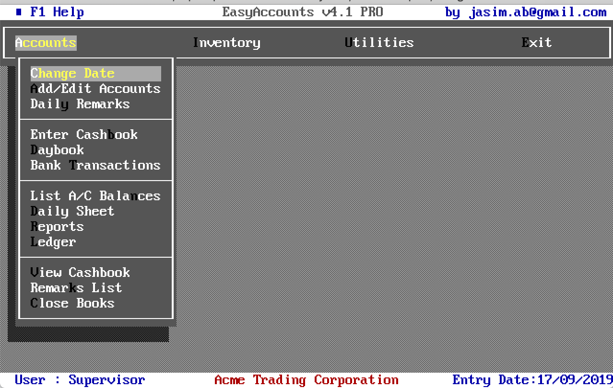
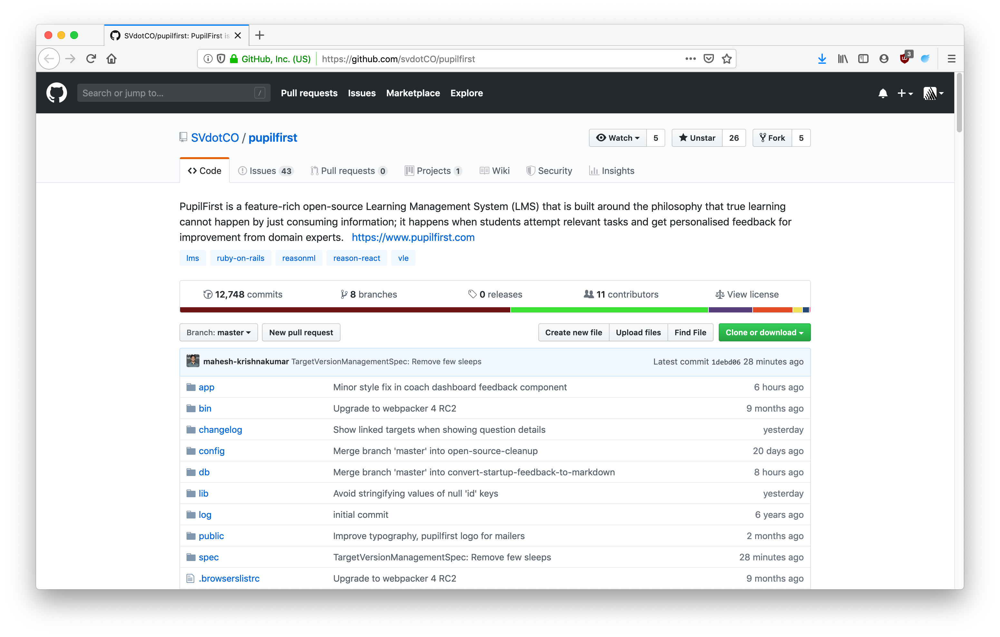

---
title: Learning to learn ReasonML
subtitle: ""
fontsize: 17pt
...

```
    
    LEARNING TO LEARN REASONML

    Jasim A Basheer 
    protoship.io

    @jasim_ab


```

 

::: notes

Hello, my name is Jasim, and I'm here today to talk about ReasonML.

:::

------------------



::: notes

A little about me, I've been programming professionally for over 10 years now. 

This is one of the earliest software that I built.

:::

------------------


::: notes

 These were easy to build. You could make software like this without having to be a professional programmer. 

But all good things have to come to an end. 

So I've since worked on modern web applications, on the front-end, back-end, and also programmed with different languages including Javascript.

Most recently I've been jamming with a friend building tools for designers & front-end developers. 

:::

------------------

### Protoship Teleport


::: notes

One is called Teleport -- it is a Chrome extension that can capture a website and create a Sketch design out of it. 

Here I'm using Teleport to re-create the Reason homepage in Sketch. 

The other tool we're building is called Protoship Codegen.

:::

------------------


::: notes

It converts designs - made in tools like Adobe XD and Sketch - into responsive HTML and CSS

Here we're a running a sample Sketch design through Codegen. 

This is the Codegen UI.

And here is the responsive HTML & CSS rendered by it.

The generated code is stuff that programmers like you and me can use. So it'll do static positioning, flexboxes, and grids etc.

:::

------------------

### Protoship Codegen


::: notes

All this stuff: the Sketch plugin, the web UI, and the code generator -- everything, is written in Reason.

But that happened only when we were about half-way through the product. Before that it was all written in Javascript.

We didn't know Reason or Typed FP when we began working on Codegen, which was about two years ago.

Let me tell you a bit about how Codegen works under the hood so you can see why we chose to learn and rewrite it in Reason.

:::

------------------

### Source data: Raw Vector Node


::: notes

See here, is the source data that Codegen has to convert to code.

This is a node for a vector design element, which was extracted from Sketch by Codegen. They're absolutely positioned, as you can see from x, y, and width and height.

Our goal is to convert this vector node into responsive HTML and CSS,

:::

------------------


::: notes

something that looks like this.

:::

------------------


::: notes

That's a multi-step process. Here's a rough pipeline of how we do that:

We start with the Vector Design tree, which is passed through this pipeline of functions, each of which transforms the tree into something closer to the final result that we want. 

In each step here, we decorate the nodes with more info, sometimes change their shapes, sometimes merge it with others, and things like that.

:::

------------------

``` {.javascript}
{
  x: 0,
  y: 64,
  name: "The classics are books",
  width: 600
  height: 63
}
```

::: notes

Here's a simplified illustration. Consider this is the initial shape of the node:

:::


------------------

``` {.javascript}
{
  x: 0,
  y: 64,
  name: "The classics are books",
  width: 600
  height: 63
}
```

``` {.javascript}
{
  nodeType: "text",
  marginLeft: 0,
  marginTop: 64,
  width: 600,
  height: 63
}
```

::: notes

Now this could be its next shape.

:::


------------------

``` {.javascript}
{
  nodeType: "text",
  marginLeft: 0,
  marginTop: 64,
  width: 600,
  height: 63
}
```

``` {.javascript}
{
  nodeType: "text",
  marginLeft: {type: "px", value: 0},
  marginTop: {type: "px", value: 64},
  width: {type: "px", value: 600},
  height: {type: "px", value: 63}
}
```

::: notes

And this could be its next shape, and so on. We had hundreds of these kinds of transformations - some small, and some big, and it was all too much for us to mentally track. 

Mistakes were made. Many mistakes, in fact, were made. 

Progress was very slow.

We wanted a better way to track the changing shape of the data as they went through each transformation. And we had an inkling that types could be the answer.

:::


------------------

 

#### Reason is released

```
AUTHOR
Jordan Walke (and Cheng Lou and others)

WROTE
React, Reason, and ReasonReact
```

::: notes

Which was when Jordan Walke, who originally wrote React, released the first version of Reason. 

Reason was a typed language, and it compiled to Javascript. So we could rewrite all our transformation code into Reason and have it work both on Node and also on the browser.

He also shipped ReasonReact a bit later, which is the Reason adaptor for React. And thanks to that we could even build UIs in Reason and mix and match it with React components and vanilla Javascript.

So that's what we did!

:::


------------------


::: notes

But learning and adopting this new language, was a bit of a struggle. 

This was our go-to book at the time. Real World OCaml. It taught us a fair bit of OCaml, but we also learnt as much about programming itself this book.

But it was also a little frustrating to work through. Because OCaml's programming approach is very different from all the Javascript and Ruby that we had written before.

But the struggle was worth it. 

It was worth so much 

that now 

when I look back on the last 10 years of my programming, I almost wonder what I was doing for the first 8 years, before I had discovered Reason and Typed Functional Programming. 

And that is why I'm so excited to be here today, and talk to you all about ReasonML. 

:::

------------------

### The Talk


* Reason: interesting bits
* How does it feel to program
* How to get started

::: notes

So in this talk I will try to describe some interesting bits of the language - especially things that are different from Javascript. 

I'll not be able to cover every single feature that makes it special, but I'll try to give a feel for how it would be to be programming with it.

I'll also talk about how to approach learning this language, based on my past experience.

Alright, now we can get started.

:::


------------------

## Reason is OCaml

* First released in 1990

* C like speeds

* ISWIM syntax (OCaml, Haskell) not ALGOL (C, Java, Javascript etc.)

::: notes

Reason is a new syntax on top of the OCaml programming language. 

OCaml has a long history - it was released about 30 years ago. It is a compiled language and produces very fast binaries.

Its syntax however is quite different from most languages that we're used to.

:::

------------------

``` {.ocaml .smallFont}
let print_html_table segments =
  printf "<table>\n";
  List.iter (fun line ->
    printf "<tr>";
    List.iter (fun c -> printf "<td>%s</td>" (escape c)) line;
    printf "</tr>\n";
  ) segments;
  printf "</table>\n";
;;
```

::: notes

Here is an OCaml program that prints an HTML table from a 2-dimensional list. See that function arguments are separated by spaces, and anonymous functions are created with the `fun` keyword.

:::

------------------

``` {.ocaml .smallFont}
let print_html_table segments =
  printf "<table>\n";
  List.iter (fun line ->
    printf "<tr>";
    List.iter (fun c -> printf "<td>%s</td>" (escape c)) line;
    printf "</tr>\n";
  ) segments;
  printf "</table>\n";
;;
```

``` {.ocaml .smallFont}
let print_html_table = segments => {
  printf("<table>\n");
  List.iter(
    line => {
      printf("<tr>");
      List.iter(c => printf("<td>%s</td>", escape(c)), line);
      printf("</tr>\n");
    },
    segments,
  );
  printf("</table>\n");
};
```

::: notes

Here's the same OCaml code, but in the Reason syntax. This is closer to ES6 as we know it - there are braces to denote blocks. The fat arrow operator lets us create functions,; and semicolons are used for separating lines.

Underneath, however Reason and OCaml are the same language and have the same semantics.

:::

------------------

## What can we build with Reason/OCaml?

::: notes

So is it actually useful? This language. What can we build with it? 

:::

------------------

#### High-frequency trading software

&nbsp;


::: notes

When you start reading about OCaml, you'll often come across Jane Street. They are one of the largest production users of the language and in 2018 about $8 trillion dollars passed through their system, and all of that used software written in OCaml.

:::

------------------

#### World's second largest crawler

&nbsp;


::: notes

If you have done any SEO work, you might be familiar with Ahrefs. They crawl about 5 million pages every minute, and they have the second largest index just after Google. They use native OCaml for all the back-end work and for the front-end web they use Reason.

:::

------------------

#### Compilers

&nbsp;

* First version of the Rust compiler
* Flow (typechecker for Javascript)
* Hack (Facebook's PHP compiler)

&nbsp;

::: notes

OCaml is also particularly nice to write compilers on - The very first version of the Rust compiler was written in OCaml.

Facebook is also a large user of OCaml internally, again for compiler work.

5mins

:::

------------------

## Front-end web applications!

&nbsp;

Compile Reason into clean performant Javascript

::: notes

Now, all these things - high frequency trading, massive web crawlers, and compilers - these are all the _traditional_ applications of OCaml. 

It can also be used to build front-end web applications, which is what this talk is about. 

So how is that done?

:::


------------------

### OCaml has three compilers:

&nbsp;

```
* ocamlc: produces executable binary
```


::: notes

OCaml has three major compilers.

The native OCaml compiler generates executable binaries that are very fast and lightweight. So if you had something you wanted to build with say GoLang, you can use OCaml or Reason instead and compile it with ocamlc. 


:::

------------------

### OCaml has three compilers:

&nbsp;

```
* ocamlc: produces executable binary

* js_of_ocaml: produces Javascript, supports only OCaml libraries
```


::: notes

Then there is js_of_ocaml -- it is a fork of the OCaml compiler, and it produces Javascript instead of native binaries. You can use any native OCaml library here, but it is not easy to interop with the Javascript ecosystem.

:::


------------------

### OCaml has three compilers:

&nbsp;

```
* ocamlc: produces executable binary

* js_of_ocaml: produces Javascript, supports only OCaml libs

* BuckleScript produces Javascript, and can use any npm package
```


::: notes

The compiler we want is BuckleScript. It produces clean, performant Javascript, and it interops nicely with npm and the rest of the Javascript ecosystem.

:::

------------------

## BuckleScript

* Clean performant Javascript
* Build NodeJS applications
* Build Browser applications


::: notes

BuckleScript is also the primary compiler for Reason. And the Javascript it generates can run both on Node and on the Browser. 

So for the rest of this talk, we're going to be talking about using the Reason syntax for OCaml, with the BuckleScript compiler.

:::

------------------

``` {.ocaml}
if (MomentRe.Moment.isSameWithGranularity(
      MomentRe.momentNow(),
      MomentRe.moment("2020-04-01"),
      `day,
    )) {
  Js.log("It is the 1st of April!");
} else {
  Js.log("A dreary day");
};
```

::: notes

Okay, here's BuckleScript in action.

The code written here, though it looks like Javascript, is actually Reason. It checks whether the current day is April 1st 2020, and then shows a message if that is so.

For this it uses the momentjs Javascript library from npm. 

Alright, now let's compile this.

:::

------------------

``` {.ocaml}
if (MomentRe.Moment.isSameWithGranularity(
      MomentRe.momentNow(),
      MomentRe.moment("2020-04-01"),
      `day,
    )) {
  Js.log("It is the 1st of April!");
} else {
  Js.log("A dreary day");
};
```

``` {.javascript}
// Generated by BUCKLESCRIPT VERSION 5.0.6, PLEASE EDIT WITH CARE
'use strict';

var Moment = require("moment");
var MomentRe = require("bs-moment/src/MomentRe.js");

if (Moment().isSame(MomentRe.moment(undefined, "2020-04-01"), "day")) {
  console.log("It is the 1st of April!");
} else {
  console.log("A dreary day");
}
```

::: notes

At the bottom is the Javascript produced by BuckleScript. It is straightforward JS, and it uses the CommonJS syntax to require the momentjs npm module.

That's one of the best thing about Reason: since we're using BuckleScript, we can use any npm library in our code. And we can integrate it into our existing Javascript projects as well. 

There is some work - you have to write type definitions for the library you want to use, but otherwise it is painless.

:::


------------------

## Paradigm

::: notes

Let's talk a little bit about programming language paradigms.

:::

------------------

&nbsp;

### Reason/OCaml is a Typed Functional language

::: notes

Reason is a Typed Functional language. 

:::

------------------

&nbsp;

### Reason/OCaml is a Typed Functional language

&nbsp;

_so is Elm, F#, Haskell, and PureScript_

Hindley–Milner type system

::: notes

So are languages like Elm, F#, and Haskell.

All these languages share the same Type System - Hindley Milner typesystem, and have a similar approach to functional programming. 

A great thing is that if you read say an article about Elm, it is highly probable that it also applies to Reason. And vice versa. 

So when you learn Reason, you're also dipping your toes into the vast, and varied world of Typed Functional Programming. 

Most things that I'll speak about in this talk will also apply equally well to the other languages in this category.

:::

------------------

## Typed FP

#### has two principles:

### 1. Write pure functions
### 2. Get their types right

::: notes

Okay, so what is Typed FP?

It is just writing our programs as a series of pure functions. That's it. 

How is that an improvement over Javascript you might ask? We can write JS also in a functional manner - with pure functions everywhere, and just an outer shell for all the I/O. That's essentially functional programming, and that's pretty nice.

But Reason is not only "functional", it is also "typed", and the types guarantees something:

:::

------------------

## Perfection

The perfect computer program -- 

::: notes

"perfection".

Reason functions are more "perfect" than functions written in Javascript. I'm using the word "perfection" here as a degree of measure and not as an absolute. 

I stole the idea from Prof. Xavier Leroy, who is a programming languages researcher and also the author OCaml

:::

------------------

> (a perfect program is) The one that does exactly what it should do, no more, no less, every time, with perfect reliability, and forever. The kind of perfection that you can get from mathematical definitions, which software is to a large extent, or from philosophical concepts.

<sub><sup>"In search of software perfection", by Dr. Xavier Leroy, author of OCaml</sub></sup>

::: notes

Prof. Leroy says that a perfect program does exactly what it should do, no more, no less, every time, with perfect reliability, and forever. The kind of perfection that you can get from mathematical definitions, which software is to a large extent, or from philosophical concepts.

But what can this mean in the context of our day-to-day work?

::: 

------------------

``` {.javascript}
let showNext = lastUser => {
  console.log("You will be user " + (lastUser.id + 1))
}
```

``` {.javascript}
showNext({id: 16})
```

```
You will be user 17
```

::: notes

Consider this function `showNext` - it tells you what your user id could be, based on the last user in the system. 

We pass it an object with id 16, and it prints 17. The code is as simple as it can get. 

But does it work perfectly reliably all the time, every time? Will it ever crash in production?

:::

------------------

``` {.javascript}
let showNext = u => {
  console.log("You will be user " + (u.id + 1))
}
```

``` {.javascript}
showNext({id: null)
```

::: notes

What if `id` is null?

:::

------------------


``` {.javascript}
let showNext = u => {
  console.log("You will be user " + (u.id + 1))
}
```

``` {.javascript}
showNext({id: null)
```

```
You will be user 1
```

::: notes

Thankfully that works. Our function is resilient to nulls.

:::

------------------

``` {.javascript}
let showNext = u => {
  console.log("You will be user " + (u.id + 1))
}
```

``` {.javascript}
showNext({id: "193"})
```

::: notes

What if id was a string?

:::

------------------

``` {.javascript}
let showNext = u => {
  console.log("You will be user " + (u.id + 1))
}
```

``` {.javascript}
showNext({id: "193"})
```

```
You will be user 1931
```

::: notes

It doesn't crash, but the result isn't what we wanted. 

:::

------------------

``` {.javascript}
let showNext = u => {
  console.log("You will be user " + (u.id + 1))
}
```

``` {.javascript}
showNext({})
```

::: notes

Now what happens when the object is empty?

:::

------------------

``` {.javascript}
let showNext = u => {
  console.log("You will be user " + (u.id + 1))
}
```

``` {.javascript}
showNext({})
```

```
You will be user NaN
```

::: notes

This is also a wrong result.

:::

------------------

``` {.javascript}
let showNext = u => {
  console.log("You will be user " + (u.id + 1))
}
```

``` {.javascript}
let users = []
let lastUserIndex = users.length - 1
let lastUser = users[lastUserIndex]

showNext(lastUser)
```

::: notes

Here we have a list of users, and we'll find the last of them and apply to `showNext`

But unfortunately, the list is empty. What happens now? 

:::

------------------

``` {.javascript}
let showNext = u => {
  console.log("You will be user " + (u.id + 1))
}
```

``` {.javascript}
let users = []
let lastUserIndex = users.length - 1
let lastUser = users[lastUserIndex]

showNext(lastUser)
```

```
Uncaught TypeError: Cannot read property 'id' of undefined
```

::: notes

The function actually crashes. 

This is a common source of error when programming in JS - we fetch a value from an array or an object -- and sometimes it doesn't exist -- which means it returns a null or an undefined. We then pass that down to other functions.. and things crash in production. Sometimes they crash far away from the place where the undefined originated, and so we have to work backwards quite a bit to debug it. 

:::

------------------

``` {.javascript}
showNext()
showNext({id: "a"})
showNext({id: {}})
showNext(undefined)
showNext(null)
showNext(0)
showNext("a")
showNext([])
showNext([1])
showNext(a => a + 1)
```

::: notes

Okay, to make a long story short, none of the invokations here would work correctly. 

:::

------------------

``` {.javascript}
showNext({id: 112})
```

```
You will be user 113
```

::: notes

The only way the function can succeed is when it receives an object which has a field `id`, which has an integer value.

So why does Javascript allow this function to be called with any other kind of argument? What if we could write functions that will always work because they always receive the right kind of data. 

It can change the way we write software.

In Reason we do this with type definitions - we can think of it is as metadata about our programs where we describe the shape and structure of all the values in the system. 

So how does that work?

:::

------------------

``` {.javascript}
type user = {

}
```

::: notes

Here is a Reason type definition; we're saying that there is a type called user

:::

------------------

``` {.javascript}
type user = {
  id
}
```

::: notes

which has a field `id`

:::

------------------

``` {.javascript}
type user = {
  id: int
};
```

::: notes

whose values are always integers.

Now let's write `showNext` in Reason.

:::

------------------

``` {.javascript}
type user = {
  id: int
};

let showNext = u => {
  Js.log("You will be user " ++ string_of_int(u.id + 1));
};
```

::: notes

You can see that there is an explicit cast from integer to string, but otherwise the Reason version looks similar to the ES6 version. Let us run it.

:::


------------------

``` {.javascript}
type user = {
  id: int
};

let showNext = u => {
  Js.log("You will be user " ++ string_of_int(u.id + 1));
};

showNext({id: 15});
```

```
You will be user 16
```

::: notes

It works. Can we send this function invalid data, and break it, just like we did with the JS version?

:::

------------------


``` {.javascript}
type user = { id: int };
let showNext = u => {
  Js.log("You will be user " ++ string_of_int(u.id + 1));
};
showNext({id: "abc"});
```


::: notes

Yes it breaks! But this is a compile-time breakage. This means no Javascript code was generated for this Reason program we wrote.

That's because the compiler found a type error in the code. 

:::


------------------

### Type Inference

``` {.javascript}
type user = { id: int };
let showNext = u => {
  Js.log("You will be user " ++ string_of_int(u.id + 1));
};
showNext({id: "abc"});
```


::: notes

It inferred that the function `showNext` expects a value of type `user`, and `user` should have an integer id column inside it. But instead of `user` we sent a random string. That'll definitely break the function in runtime, so Reason wouldn't allow it to move past compilation.

But how did Reason figure out that `showNext` expects a value of type `user`? We haven't mentioned that explicitly anywhere. What's happening is "type inference" -- if you imagined that you'll have to litter your codebase with type annotations, then type inference will make you happy.

Based on the context, Reason figures out the types of values and arguments to functions. It works well even for large programs.

Now let's see how Reason fares with other invalid values.

:::

------------------

``` {.javascript}
showNext({id: []});
```


::: notes

We're passing in a list instead of an integer. Type error.

:::

------------------

``` {.javascript}
showNext(a => a + 1);
```


::: notes

Here's a function instead of the entire `user` object. Type error again. 

:::


------------------

``` {.javascript}
type user = { id: int };

let showNext = u => {
  Js.log("You will be user " ++ string_of_int(u.id + 1));
};

showNext({id: 44});
showNext({id: 299});
showNext({id: -44});
```

```
You will be user 45
You will be user 300
You will be user -4
```

::: notes

We can keep going, but the only way to get the program to compile is to pass `showNext` the correct data. That's the number one promise of Typed FP.

:::

------------------

&nbsp;
&nbsp;

### compile-time vs runtime errors

_a stitch in time saves nine_

::: notes

Let's back up a bit here so I can try to impress upon you the important distinction between a "compile-time error" and a "runtime error".

:::

------------------

### Syntax errors are caught early

``` {.javascript}
console.log("program started executing")
let text = Hello! This is a syntax error.
```

::: notes

This is supposed to be a Javascript program. But it won't even execute, because the second line has the wrong syntax. The first line is valid by the way -- but it won't print anything because the whole program will be rejected, with this error message:

:::

------------------

### Syntax errors are caught early

``` {.javascript}
console.log("program started executing")
let text = Hello! Is it Javascript you're looking for?
```

```
let text = Hello! Is it Javascript you're looking for?
                ^
SyntaxError: Unexpected token !
    at createScript (vm.js:80:10)
    at Object.runInThisContext (vm.js:139:10)
    at Module._compile (module.js:617:28)
    at Object.Module._extensions..js (module.js:664:10)
    ...
```

::: notes

That is a good thing - it is best to know problems as early in the programming cycle as possible. 

But imagine if programs were executed despite syntax errors. 

You'll ship the program to customers, and they'll be in the middle of something, and then some semicolon is missing somewhere and boom! the program halts to a crash.

:::

------------------

&nbsp;
&nbsp;

#### Reason moves runtime errors into compile-time errors

_as if they were syntax errors..._

::: notes

The genius of Reason and Typed Functional Programming in general is that a lot of common mistakes become compile-time errors rather than runtime errors. 

It is like our syntax checking became a lot more smarter - we no longer have to run and test the code manually to catch mistakes.

Let's look at an example.

:::

------------------

``` {.javascript}
let showNext = lastUser => {
  console.log("You will be user " + (lastUser.id + 1))
}

let users = []
let lastUserIndex = users.length - 1
let lastUser = users[lastUserIndex]

showNext(lastUser)
```

::: notes

Going back to this Javascript program -- here we fetch the last user from a list, and does something with it. The list however is empty, and so `lastUser` will be undefined.

:::

------------------


``` {.javascript}
let showNext = lastUser => {
  console.log("You will be user " + (lastUser.id + 1))
}

let users = []
let lastUserIndex = users.length - 1
let lastUser = users[lastUserIndex]

showNext(lastUser)
```

```
Uncaught TypeError: Cannot read property 'id' of undefined
```

::: notes

So it crashes during execution with a runtime error. 

In Reason however, this error sort of becomes a syntax error rather than a runtime error. The compiler will catch the mistake and we don't have to run it to see if it breaks.

:::

------------------


``` {.javascript}
type user = {id: int};

let showNext = u => {
  Js.log("You will be user " ++ string_of_int(u.id + 1));
};

let users = [||];  /* empty array */
let lastUserIndex = users[Array.length(users) - 1];
let lastUser = users[lastUserIndex];

showNext(lastUser);

```

::: notes

Here's the Reason equivalent of the same program. This won't even execute. Instead we'll get this compile-time error:

:::

------------------


::: notes

What is this error message saying?

In Line 12, we're calling showNext, and it is expecting a value of type user.
But, we're passing it something of type option('a).

What's happening is that in line 11, we've tried fetching an element from the array `users`. Reason knows that whenever you fetch something from an array,  using an integer index, then it is quite possible that the element might not exist.

Which is why it is returning a value who has an optional type. So how would we write this instead?

:::

------------------


``` {.javascript}
switch(lastUser) {
  | None => Js.log("No users in the list")
  | Some(user) => showNext(user)
};
```

::: notes

We'll replace line number 12 with this code. What we're doing is acknowledging the fact that lastUse could be empty. And we handle both cases where it could exist or where it could be empty.

So instead of null, or undefined, Reason has the option type. When something is of the option type, it means the compiler knows that it may or may not have a value during runtime. So we're forced to deal with that situation before it will compile the code.


:::

------------------


&nbsp;

&nbsp;

### Refactor confidently!

::: notes

Option types is one of the most amazing things about Typed FP. It gives us the kind of confidence in our code that we can refactor mercilessly, aggressively without worrying that we'll make mistakes.

Because of this a lot of my programming anxiety went away after I started programming with Reason. I can refactor large, complex codebases confidently because I know that Reason has my back. 

:::

------------------

&nbsp;

&nbsp;

### Refactor confidently!
### because _if it compiles, it works_

::: notes

Or in other words:

if the program compiles, it works.

It is true! 

But, what about logical mistakes?

:::


------------------

```
  if item == "tea"
    pourCoffee()
  else
    pourTea()
```

::: notes

Here someone asked for a tea, and we poured them a coffee. 

This code is going to compile, but it is obviously wrong. This is a logical mistake, and not a type error, and so the compiler simply cannot catch it.

:::

------------------

&nbsp;

### Logical mistakes are few, 
### clerical mistakes are many!

::: notes

But when I started writing typed FP after about a decade of dynamically typed languages, I realized that we programmers are a pretty decent bunch. We don't make as many logical mistakes as we think we do.

Our programs are all broken, make no mistake, but they are broken not because we wrote something when we meant the other. They're borken because of clerical mistakes. Because we passed the wrong data to the wrong function. 

But the Reason compiler is very good at catching those kind of mistakes, which is why "if it compiles, it works" is an experience you can also look forward to when you start writing Reason.

:::


------------------

## Dealing with external data

::: notes

So far so good. But if we say that Reason can only deal with well-typed data, then how can it work with external data which our programs have no control over?

:::

------------------


::: notes

like content that we read from the database

:::


------------------


::: notes

or JSON API responses

:::


------------------


::: notes

or even user inputs from the browser.

:::


------------------


::: notes

We handle it in Reason by parsing all external data at the application boundary.

:::


------------------


::: notes

If the data that hits the application doesn't slot into their corresponding types, then there is no way the data can proceed to the rest of the appliaction. Maybe it is an old API format and we're on a new version. So there is nothing to be done except reject it and return an HTTP error code.

Or the incoming data is incomplete -- but we can handle it gracefully by putting placeholder values. 

The point is we cannot allow malformed data into our system. Either we handle it, or we stop the request there.

:::


------------------


::: notes

But if there are no issues, then this data gets parsed into our application types, and it hits the core.

:::


------------------


::: notes

We can write this core without a single defensive check; no worries about null errors; not bothered whether the objects will have the right shape. We know, thanks to types, that everything will be just perfect.

:::

------------------

## Ideas in Typed FP

::: notes

What I covered so far in this talk is a very thin slice of the ideas in the Typed FP paradigm. 

:::

------------------

## Ideas in Typed FP

* pure functional programming
  * light-weight syntax for currying and partial application
  * linked-lists over arrays
  * recursion over imperative loops


::: notes

For example we haven't looked at functional programming at all. I think that most of us who write Javascript is already doing a fair amount of FP, and especially so if you use React.

But Reason adds a few things which makes it a better functional language than JS. 

I've listed some them here - these are all very worth knowing.

:::

------------------


## Ideas in Typed FP

* sum types:
  * make invalid states impossible
* no null, but option types!
* exhaustive pattern matching

::: notes

These ideas are all around Reason's type system. They are also quite fun.

:::

------------------

## Ideas in Typed FP

* expose concrete types rarely
* interfaces before implementations

::: notes

Here's another set of ideas - these are from the Real World OCaml book.

If you want to know about all these things, you can find talks and blogs on the internet, but the best thing to do would be to learn Reason, build something in it and experience them yourself.

:::

------------------

### Learning Reason

::: notes

So that's what we'll talk about next.

If you had to give Reason a shot, how would you go about it? 

:::

------------------

## A comparison

Concepts that carry over from Javascript to Reason

::: notes

First let's see what concepts you can take away from Javascript into Reason.

:::

------------------

## Javascript vs Reason

* **Javascript**: `this`, variable hoisting, prototypes, ES6 classes, objects, mutations, _functions, modules_

* **Reason**: _functions, modules, types_

::: notes
Except for types, Reason is, in a sense, a subset of Javascript.

Javascript is a large language -- which could be obvious if you've participated in any Javascript job interview. 

You can ask and be asked so many questions. There is the concept of `this`, there are prototypes and prototype inheritance chains, and there are also classes, objects, and mutation. It also has functions and higher-order functions.

Compared to a Javascript job interview, a Reason interview could be rather uneventful; because it is a much smaller language than JS. All it has are functions, modules, and types. 

:::

------------------

## How to learn

&nbsp;

Start building UIs with ReasonReact

``` {.javascript}
[@react.component]
let make = (~name) =>
  <button>
    {React.string("Hello!")}
  </button>;
```

::: notes

So what is the fastest way to really learn Reason? 

You can start by building simple user interfaces with ReasonReact. We usually learn new things by what is called programming by poking. Find a new library, copy paste some sample code, and start tweaking it till we make it work. That approach will go a long way to get you started.

But it doesn't scale for ever.

:::

------------------

&nbsp;
&nbsp;

### Learn systematically

#### Don't worry about immediate application

::: notes

It is because if you try building something real and hit a roadblock, you wouldn't know what even Google for, and where to look. 

So initially you have to go through the catalog of language features and learn them -- without looking for any immediate application. 

:::

------------------

### Learning Outline

* **Programming in the small**
  * variables, data structures, iteration, functions

::: notes

The first phase usually is to learning to program in the small. 

You should be able to solve a fizzbuzz, read from a file, compute an average, make an API request -- all these things. 

The concepts they need are quite common: data structures, creating functions and calling them etc.

:::

------------------

### Learning Outline

* **Programming in the small**
  * variables, data structures, iteration, functions


::: notes

For this you should comb through official Reason documentation. It is specifically written for people from the Javascript world and is very accessible.

:::

------------------

### Learning Outline

* Programming in the small
* **Tooling**

::: notes

Next, you need to get comfortable with the tooling. 

You should be able to create a project, compile, and start tinkering on demand. That is a simple but very crucial step. 

Knowing the tooling is the difference between wishing you had the time to play with something vs actually having fun with it.

:::


------------------

### Learning Outline

* **Tooling**
  * VSCode + Reason plugin
  * Official setup instructions


::: notes

In Reason's case, tooling is very easy to setup. 

The official setup guide is about 4 lines - install an npm package, start webpack and you're done.

I would also recommend using VSCode + the VSCode Reason plugin - it is the most supported editor for Reason.

:::

------------------

### Learning Outline

* **Programming in the large**
  * modules

::: notes

The third thing to know is to how to Program in the Large. 

Have you ever been in a place where you know a thing - a language or a library - but you're not yet confident to use it in production?

The missing thing usually is not knowing how to fit things into a larger canvas. In the case of Reason, the only construct you need to know is  the `module`. It is very similar to regular JS modules -- you can put a bunch of functions together, expose only a few public ones, and that's it.

:::

------------------

### Book Recommendation


::: notes

The best resource for systematic study of OCaml is the book Real World OCaml. It uses the OCaml syntax, but you'll get used to that soon. It is a great book because it teaches not just OCaml the language. You can also expect some very practical, very profound insights on programming as a whole, from this book.

::: notes

------------------

## Closing thought 

### Is Reason ready for production?

::: notes

Finally, the elephant in the room. Is Reason commercially viable? Is it something you can use in your workplace?

My experience has obviously been great, and I think it is very much ready for production. For example a large chunk of Facebook's Messenger front-end is already running on Reason.

But Facebook is far away, let's take look at a project that is much closer to home..

:::

------------------


::: notes

The project is called PupilFirst. It is a learning management solution - you can create courses, teach students, and manage their progress.

The entire front-end is written in Reason and compiled with BuckleScript. 

:::


------------------


::: notes

It has a complex data model and advanced UI patterns.

:::


------------------


::: notes

It is built here in Bangalore.

:::


------------------



::: notes

And it is fully open-source. One of the authors, Hari Gopal, is also a JsFoo speaker. He had spoken in last year's conference and that was also about Reason.

This is a good reference repository if you want to see a real-world reason web application that is used in production.

:::

------------------


#### Learning to learn ReasonML


::: notes

So that was the talk Learning to Learn Reason.

Thank you so much for listening!

I hope you enjoyed it, and I'm also eager to hear your questions.

Thank you.

:::