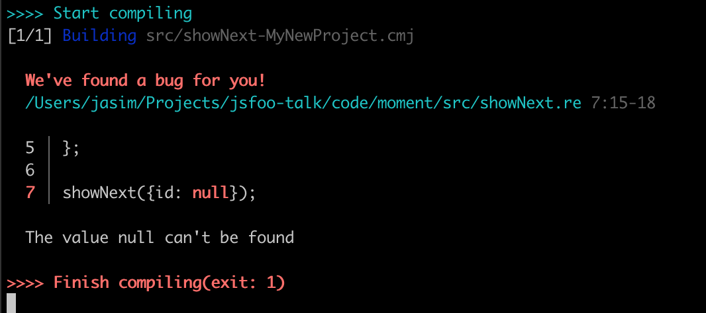

---
title: Learning to learn ReasonML
subtitle: ""
fontsize: 17pt
...

```
    
    LEARNING TO LEARN REASONML

    Jasim A Basheer 
    protoship.io

    @jasim_ab


```

&nbsp;

::: notes

Hello, my name is Jasim, and I'm here today to talk about ReasonML.

:::

------------------


::: notes

A little about me, I've been programming professionally for over 10 years now. 
This is one of the earliest software that I built.

:::

------------------


::: notes

It is very portable - runs on any architecture that can run DOSBOX

Since then I've worked on web applications, front-end, back-end, and different languages including Javascript.

Most recently I've been jamming with a friend building tools for designers. 

:::

------------------

### Protoship Teleport


::: notes

One is called Teleport -- it is a Chrome extension that can capture a website and create a Sketch design out of it.

The other tool, that's where this story begins. It is called Protoship Codegen.

:::

------------------


::: notes

It converts designs - made in tools like Adobe XD and Sketch - into responsive HTML and CSS that programmers like you and me can use. So it'll do static positioning, flexboxes, grids etc. And CSS that is cleaner than anything that I'd be able to manually write. 

On the screen is a sample Sketch design,

:::


------------------


::: notes

and this is how it gets converted to code. This is the Codegen UI, and the rendering is all clean HTML and CSS. 

All this stuff: the Sketch plugin, the Adobe XD plugin, the converter, the web UI, and the code generator -- they're all written in Reason. 

But before that it was all written in plain Javascript.

We didn't know Reason or Typed FP when we first started working on this product over two years ago. We were forced to learn it. Let me tell you why.

:::


------------------

### Raw Vector Node


::: notes

Here's the raw vector node that Codegen extracts from Sketch. They're absolutely positioned, and is a far way from being responsive HTML and CSS.

:::

------------------


::: notes

The challenge is to convert that raw node this HTML and CSS. That's a multi-step process. Here's a rough pipeline of how Codegen does it:

:::

------------------


::: notes

In each step here, we decorate the nodes with more info, sometimes change their shapes, sometimes merge it with others, and generally wrangle with them quite a bit.

Even within each step the nodes would transform into different structures. We couldn't mentally track the flow of data because of all these transformations and were making silly mistakes. Worse, because of our programs were muddled, our very understanding of the domain was degrading.

:::


------------------

&nbsp;

#### Reason is released

```
AUTHOR
Jordan Walke (and Cheng Lou and others)

WROTE
React, Reason, and ReasonReact
```

::: notes

That was the time around when Jordan Walke, the original author of React, released the first version of Reason. ReasonReact is the Reason adapter for the React library. This means you can build React applications with Reason and even mix and match components between Javascript and Reason.

:::


------------------


::: notes

Learning and adopting the language was a long struggle. It was the early days of Reason so there weren't many resources. We spent countless hours with the Real World OCaml book - excellent book on the language as well the craft of programming itself. There are numerous resources now and much easier to learn the language.

But the struggle was worth it. When I look back on the last 10 years of my programming career, I wonder what I was doing for the first 8, before I learned Reason and Typed functional programming.

And that's why I'm here today to talk about it. 

:::

------------------

### The Talk


* Reason: interesting bits
* How does it feel to program
* How to get started

::: notes

In this talk I will try to describe the interesting bits of Reason; try to give you a feel for what it is to program with it; and finally leave with a few pointers on how to get started.

:::


------------------

## Reason is OCaml

* First released in 1990

* C like speeds

* ISWIM syntax (OCaml, Haskell) not ALGOL (C, Java, Javascript etc.)

::: notes

Reason is a new syntax on top of the OCaml programming language. 

OCaml has a long history - it was first released in 1990 - about 30 years ago. It is a compiled language and produces very fast binaries.

Its syntax however is quite different from most languages that we're used to.

:::

------------------

``` {.ocaml .smallFont}
let print_html_table segments =
  printf "<table>\n";
  List.iter (fun line ->
    printf "<tr>";
    List.iter (fun c -> printf "<td>%s</td>" (escape c)) line;
    printf "</tr>\n";
  ) segments;
  printf "</table>\n";
;;
```

::: notes

Here is an OCaml program that prints an HTML table from a 2-dimensional list. See that function arguments are separated by spaces, and anonymous functions are created with the `fun` keyboard.

:::

------------------

``` {.ocaml .smallFont}
let print_html_table segments =
  printf "<table>\n";
  List.iter (fun line ->
    printf "<tr>";
    List.iter (fun c -> printf "<td>%s</td>" (escape c)) line;
    printf "</tr>\n";
  ) segments;
  printf "</table>\n";
;;
```

``` {.ocaml .smallFont}
let print_html_table = segments => {
  printf("<table>\n");
  List.iter(
    line => {
      printf("<tr>");
      List.iter(c => printf("<td>%s</td>", escape(c)), line);
      printf("</tr>\n");
    },
    segments,
  );
  printf("</table>\n");
};
```

::: notes

Here's the same OCaml code, but in the Reason syntax. This is closer to ES6 as we know it - there are braces to denote blocks. The fat arrow operator lets us create functions and semicolons for separating lines.

Underneath, however Reason and OCaml are the same language and have the same semantics. In this presentation I'll use refer to Reason and OCaml interchangeably, depending on what fits the context better.

:::

------------------

## What can we build with Reason/OCaml?

::: notes

So is it actually useful? This language. What can we build with it? Let me take you through some examples.

:::

------------------

#### High-frequency trading software

&nbsp;


::: notes

When you start reading about OCaml, you'll often come across Jane Street. They are one of the largest production users of the language and they do billions of dollars worth of trading, all with software written in OCaml.

:::

------------------

#### World's second largest crawler

&nbsp;


::: notes

If you have done any SEO work, you might be familiar with Ahrefs. They crawl about 5 million pages every minute, and they have the second largest index just after Google. They use native OCaml for all the back-end infra and for the front-end web they use Reason.

:::

------------------

#### Compilers

&nbsp;

* First version of the Rust compiler
* Flow (typechecker for Javascript)
* Hack (Facebook's PHP compiler)

&nbsp;

::: notes

OCaml is also particularly nice to write compilers on - in fact anything that deals with a lot of tree manipulation is a great fit. Rust borrows many ideas from OCaml, and their first compiler was written in the language. Facebook is also a large user of OCaml internally.

5mins

:::

------------------

## Front-end web applications!

&nbsp;

Compile Reason into clean performant Javascript

#### using the BuckleScript compiler


::: notes

Those were the traditional applications of OCaml. 

OCaml can also be used to build front-end web applications, which is what this talk is about.

There is an OCaml compiler called BuckleScrip, built at Bloomberg. Bloomberg also uses OCaml in their trading desks. BuckleScript emits performant Javascript and also lets us use any npm package with Reason almost seamlessly.

:::


------------------


::: notes

This is PupilFirst. It is a learning management system built here in Bangalore. It has complex interactions and a large data model. The UI is entirely written in Reason and ReasonReact, and compiled using the BuckleScript compiler.

:::


------------------


::: notes

Oh and it is fully open-source. If you want to see a real-world Reason web application, there is no better place to look. One of the authors, Hari Gopal, had also spoken at last year's JsFoo on Reason.

:::

------------------

``` {.ocaml}
if (MomentRe.Moment.isSameWithGranularity(
      MomentRe.momentNow(),
      MomentRe.moment("2020-04-01"),
      `day,
    )) {
  Js.log("It is the 1st of April!");
} else {
  Js.log("A dreary day");
};
```

::: notes

This Reason code here - it checks whether the current day is April 1st 2020,
and then shows a message.

It uses the momentjs Javascript library from npm. Now let's see how the BuckleScript output looks.

:::

------------------

``` {.ocaml}
if (MomentRe.Moment.isSameWithGranularity(
      MomentRe.momentNow(),
      MomentRe.moment("2020-04-01"),
      `day,
    )) {
  Js.log("It is the 1st of April!");
} else {
  Js.log("A dreary day");
};
```

``` {.javascript}
// Generated by BUCKLESCRIPT VERSION 5.0.6, PLEASE EDIT WITH CARE
'use strict';

var Moment = require("moment");
var MomentRe = require("bs-moment/src/MomentRe.js");

if (Moment().isSame(MomentRe.moment(undefined, "2020-04-01"), "day")) {
  console.log("It is the 1st of April!");
} else {
  console.log("A dreary day");
}
```

::: notes

As you can see BuckleScript required the correct npm module and compiled everything to straightforward Javascript. 

:::

------------------

## Javascript vs Reason

* **Javascript**: `this`, variable hoisting, prototypes, ES6 classes, objects, mutations, _functions, modules_

* **Reason**: _functions, modules, types_

::: notes
Javascript however is a large language -- it has far too many concepts -- and that is obvious if you've participated in any Javascript interview. You can ask and be asked so many questions. There is the concept of `this`, there is prototypes and prototype inheritance chains which have their own rules, and there are also classes, objects, and mutation. It also has functions and higher-order functions.

Reason comparatively is a smaller language. It only has functions, modules, and types.  We don't, for example, concern ourselves with what `this` could be during runtime. In fact a Reason interview would be a rather unexciting event - there aren't that many quirks to the language to deal with.
:::

------------------

## Programming in Reason

Two principles:

1) Write pure functions
2) Get their types right

::: notes

The way we program Reason is to write our programs as a series of pure functions. That's it. 

But how is that an improvement over Javascript? We can write Javascript in a similar manner - with pure functions everywhere, and just an outer shell for all the I/O. That's essentially functional programming, and that's pretty nice.

But Reason is not only "functional", it is also "typed", and the types guarantee something:

:::

------------------

## Perfection

The perfect computer program -- 

::: notes

"perfection".

Reason functions are more "perfect" than functions written in Javascript. I'm using the word "perfection" here, based on a talk given by Prof. Xavier Leroy, who is a programming languages researcher and also the author OCaml

:::

------------------

> (a perfect program is) The one that does exactly what it should do, no more, no less, every time, with perfect reliability, and forever. The kind of perfection that you can get from mathematical definitions, which software is to a large extent, or from philosophical concepts.

<sub><sup>"In search of software perfection", by Dr. Xavier Leroy, author of OCaml</sub></sup>

::: notes

"A perfect program does exactly what it should do, no more, no less, every time, with perfect reliability, and forever. The kind of perfection that you can get from mathematical definitions, which software is to a large extent, or from philosophical concepts."

What can that mean in the context of our day-to-day programming work? Let's take a look.

::: 

------------------

``` {.javascript}
let showNext = lastUser => {
  console.log("You will be user " + (lastUser.id + 1))
}
```

``` {.javascript}
showNext({id: 16})
```

```
You will be user 17
```

::: notes

Consider this function `showNext` - it tells you what your user id could be, based on the last user in the system. 

We pass it an object with id 16, and it prints 17. The code is as simple as it can get. 

But does it work perfectly reliably all the time, every time? Will it ever crash in production?

:::

------------------

``` {.javascript}
let showNext = u => {
  console.log("You will be user " + (u.id + 1))
}
```

``` {.javascript}
showNext({id: null)
```

::: notes

What if `id` is null?

:::

------------------


``` {.javascript}
let showNext = u => {
  console.log("You will be user " + (u.id + 1))
}
```

``` {.javascript}
showNext({id: null)
```

```
You will be user 1
```

::: notes

Thankfully that works. Our function is resilient to nulls.

:::

------------------

``` {.javascript}
let showNext = u => {
  console.log("You will be user " + (u.id + 1))
}
```

``` {.javascript}
showNext({id: "193"})
```

::: notes

What if id was a string?

:::

------------------

``` {.javascript}
let showNext = u => {
  console.log("You will be user " + (u.id + 1))
}
```

``` {.javascript}
showNext({id: "193"})
```

```
You will be user 1931
```

::: notes

It doesn't crash, but the result isn't what we wanted. 

:::

------------------

``` {.javascript}
let showNext = u => {
  console.log("You will be user " + (u.id + 1))
}
```

``` {.javascript}
showNext({})
```

::: notes

Now what happens when the object is empty?

:::

------------------

``` {.javascript}
let showNext = u => {
  console.log("You will be user " + (u.id + 1))
}
```

``` {.javascript}
showNext({})
```

```
You will be user NaN
```

::: notes

This is also a wrong result.

:::

------------------

``` {.javascript}
let showNext = u => {
  console.log("You will be user " + (u.id + 1))
}
```

``` {.javascript}
let users = []
let lastUser = users[users.length - 1]

showNext(lastUser)
```

::: notes

Here we have a list of users, and we'll find the last of them and apply to `showNext`

But unfortunately, the list is empty. What happens now?

:::

------------------

``` {.javascript}
let showNext = u => {
  console.log("You will be user " + (u.id + 1))
}
```

``` {.javascript}
let users = []
let lastUser = users[users.length - 1]

showNext(lastUser)
```

```
Uncaught TypeError: Cannot read property 'id' of undefined
```

::: notes

The function actually crashes. 

This is a common source of error when programming in JS - we fetch a value from an array or an object -- and sometimes it doesn't exist -- which means it returns a null or an undefined. We then pass that down to other functions.. and things crash in production. Sometimes they crash far away from the place where the undefined originated, and so we have to work backwards quite a bit to debug it. 

:::

------------------

``` {.javascript}
showNext()
showNext({id: "a"})
showNext({id: {}})
showNext(undefined)
showNext(null)
showNext(0)
showNext("a")
showNext([])
showNext([1])
showNext(a => a + 1)
```

::: notes

Okay, to make a long story short, none of the invokations here would work correctly. 

:::

------------------

``` {.javascript}
showNext({id: 112})
```

```
You will be user 113
```

::: notes

The only way the function can succeed is when it receives an object which has a field `id`, which has an integer value.

So why does Javascript allow this function to be called with any other kind of argument? What if we could write functions that will always work because they always receive the right kind of data. It will change the way we write software.

This is done in Reason with type definitions - it is sort of a metadata that mentions what the shape and structure of different values in the program are.

Let's see how that works.

:::


------------------

``` {.javascript}
type user = {

}
```

::: notes

Here is a Reason type definition; we're saying that there is a type called user

:::

------------------

``` {.javascript}
type user = {
  id
}
```

::: notes

which has a field `id`

:::

------------------

``` {.javascript}
type user = {
  id: int
};
```

::: notes

whose values are always integers.

Now let's write `showNext` in Reason.

:::

------------------

``` {.javascript}
type user = {
  id: int
};

let showNext = u => {
  Js.log("You will be user " ++ string_of_int(u.id + 1));
};
```

::: notes

You can see that there is an explicit cast from integer to string, but otherwise the Reason version looks similar to the ES6 version. Let us run it.

:::


------------------

``` {.javascript}
type user = {
  id: int
};

let showNext = u => {
  Js.log("You will be user " ++ string_of_int(u.id + 1));
};

showNext({id: 15});
```

```
You will be user 16
```

::: notes

It works. Can we send this function invalid data, and break it, like we did with the JS version?

:::

------------------


``` {.javascript}
type user = { id: int };
let showNext = u => {
  Js.log("You will be user " ++ string_of_int(u.id + 1));
};
showNext({id: "abc"});
```


::: notes

Yes it breaks! But this is a compile-time breakage. This means no Javascript code was generated for this Reason program we wrote.

That's because the compiler found a type error in the code.

:::


------------------

``` {.javascript}
type user = { id: int };
let showNext = u => {
  Js.log("You will be user " ++ string_of_int(u.id + 1));
};
showNext({id: "abc"});
```


::: notes

It inferred that the function `showNext` expects a value of type `user`, and `user` should have an integer id column inside it. But instead of `user` we sent a random string. That'll definitely break the function in runtime, so Reason wouldn't allow it to move past compilation.

But how did Reason figure out that `showNext` expects a value of type `user`? We haven't mentioned that explicitly anywhere. What's happening is "type inference" -- if you imagined that you'll have to litter your codebase with type annotations, then type inference will make you happy.

Based on the context, Reason figures out the types of values and arguments to functions. It works well even for large programs.

Now let's see how Reason fares with other invalid values.

:::

------------------

``` {.javascript}
showNext({id: []});
```


::: notes

We're passing in a list instead of an integer. Type error.

:::

------------------

``` {.javascript}
showNext(a => a + 1);
```


::: notes

Here's a function instead of the entire `user` object. Type error again. 

:::


------------------

``` {.javascript}
type user = { id: int };

let showNext = u => {
  Js.log("You will be user " ++ string_of_int(u.id + 1));
};

showNext({id: 44});
showNext({id: 299});
showNext({id: -44});
```

```
You will be user 45
You will be user 300
You will be user -4
```

::: notes

We can keep going, but the only way to get the program to compile is to pass `showNext` the correct data. That's the number one promise of Typed FP.

:::


------------------

&nbsp;

&nbsp;

### If it compiles, it works

::: notes

A lot of my programming anxiety went away after I started programming with Reason. Because I know that if my program compiles, it works.

Its true! 

But, what about logical errors?

:::


------------------

```
  if item == "tea"
    pourCoffee()
  else
    pourTea()
```

::: notes

Here someone asked for a tea, and we poured them a coffee. It will compile, but it is obviously wrong. This is a logical error, not a type error, and so the compiler cannot catch it.

:::

------------------

&nbsp;

### Programming is difficult...

due to clerical errors.

Logical mistakes are rare!

::: notes

But when I started writing typed FP after about a decade of dynamically typed languages, I realized that we programmers are a pretty decent bunch. It is very rare for us to be making logical errors in our code.

Our programs are all broken, make no mistake, but they are broken not because we wrote something when we meant the other. They're borken because of clerical mistakes. Passing the wrong data to the wrong function. 

But the Reason compiler is very good at catching those mistakes, which is why, "if it compiles, it works".

:::


------------------


::: notes

There is also something else to note: the program has no control over what data comes from the external world - like content that we read from the database

:::


------------------


::: notes

or JSON API responses

:::


------------------


::: notes

or even user inputs from the browser.

:::


------------------


::: notes

We handle it in Reason by parsing all external data at the application boundary. In this picture I've labelled it as the "application membrane". 

(It is not a formal concept or anything by the way, I just made it up. But it has a nice ring to it no?)

:::


------------------


::: notes

If the data that hits the application doesn't slot into their corresponding types, then we can handle it then and there. Maybe it is an old API format and we're on a new version. So there is nothing to be done except reject it and return an HTTP error code.

Or the incoming data is incomplete -- but we can handle it gracefully by putting placeholder values. 

Or it is simply wrong data and not salvageable. The point is we cannot allow malformed data into our system. Either we handle it, or we stop the request there.

:::


------------------


::: notes

But if there are no issues, then this data gets parsed into our application types, and it hits the core.

:::


------------------


::: notes

We can write this core without a single defensive check; no worries about null errors; not bothered whether the objects will have the right shape. We know, thanks to types, that everything will be just perfect.

You might have more question here: what happens if you have the wrong data _inside_ the core application code? What if something is created internally and sent to the wrong function. 

These are very interesting questions. Once you get it, it is like revealing a magic trick, there is nothing mystical about it anymore. 

But to me, finding those answers by myself were some of the most exciting discoveries in the last couple of years of programming. I wont explain it here because I'd like you to seek it out yourselves.

:::

------------------

### Learning Reason

* Programming in the small
  * variables, data structures, iteration, functions


::: notes

To become proficient in Reason we have to first learn how to write small programs in it. You should be able to solve a fizzbuzz, read from a file, compute an average -- all these things.

The official Reason documentation is great for this.

:::


------------------

### Learning Reason

* Programming in the small
  * variables, data structures, iteration, functions

* Tooling


::: notes

You 

:::


------------------

* Programming in the large
  * modules, packages


::: notes

:::


------------------

#### Refactoring (2nd edition) 
#### by Martin Fowler


::: notes


:::


------------------


``` {.javascript}
let plays = {
  "hamlet": { "name": "Hamlet", "type": "tragedy" },
  "as-like": { "name": "As You Like It", "type": "comedy" },
  "othello": { "name": "Othello", "type": "tragedy" }
}

let invoices = [{
  "customer": "BigCo",
  "performances": [
    { "playID": "hamlet", "audience": 55 },
    { "playID": "as-like", "audience": 35 },
    { "playID": "othello", "audience": 40 }]
}];
```

::: notes


:::


------------------

``` {.javascript}
showNext({id: null});
```



::: notes

But what about null? What if we pass null to `showNext`?

Again the code does not compile. This is because Reason doesn't even have the concept of nulls. the concept of nulls. So instead of allowing to run the code and crash at runtime, it simply prevents the code from even being even executed. 

But we use nulls in Javascript to represent the "absence" of something. Reason does have an elegant way to do that. I will show how that works soon.

:::
